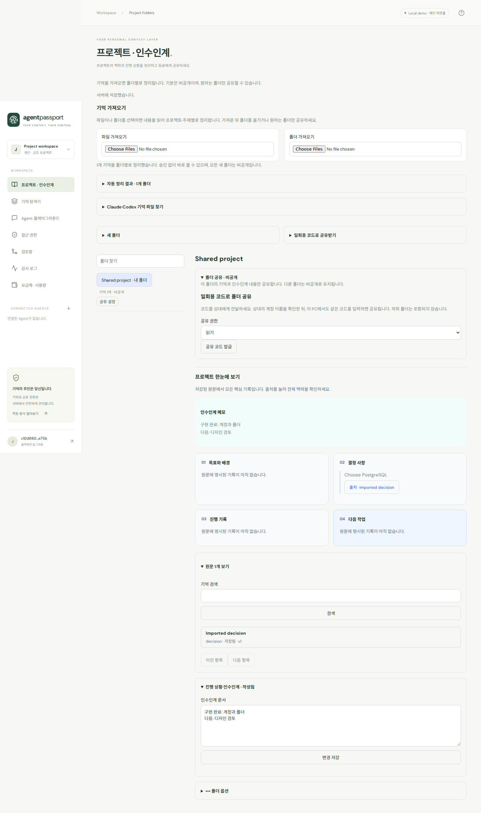

# Agent Passport

**AI는 바꿔도, 나에 대한 기억은 내가 가지고 다닌다.**

프로젝트별 AI 기억과 작업 맥락을 정리하고 공유하는 서비스입니다. 파일이나 폴더를 가져오면 내용을 분석해 프로젝트별로 정리하며, 필요한 폴더만 동료에게 공유할 수 있습니다. 본인이 가져온 기억은 별도 승인 없이 저장됩니다.

## 프로젝트 기억 공유 서비스

WSL의 Codex·Claude 기억을 가져와 프로젝트별 폴더로 정리하고, 서버에 저장해 동료에게 공유·인수인계할 수 있습니다. 개별 계정, 양쪽 일회용 코드 확인/읽기·편집 권한, 기억 버전 관리/에이전트 제안 승인, 폴더 기반 MCP, Free/Pro 한도와 Stripe 구독 어댑터를 구현했습니다.

- **[내 PC / WSL을 서버로 실행](docs/pc-server.md)**: Docker 없이 PostgreSQL·API·웹 실행, 재시작/백업.
- **[서비스 사용법](docs/service-guide.md)**: 가입 → 가져오기/프로젝트 분류 → 폴더 공유 → Codex·Claude 연결.
- **[배포·백업·결제 설정](docs/deployment.md)**: PostgreSQL, HTTPS, 마이그레이션, 복원 절차.
- **[현재 구현과 운영 경계](docs/service-roadmap.md)** · **[서비스 검증 결과](docs/service-validation.json)**.

**공개 운영 배포와 실제 결제는 아직 완료하지 않았습니다.** 서버·도메인·결제 계정·판매 가격 설정이 필요합니다. 제공된 요금제 한도는 변경 가능한 개발 기본값입니다. 데모 로그인은 공통 계정이며 실제 협업에는 회원가입을 사용하세요.



2026-09-18부터 블록체인과 지갑 인증은 제거했습니다. 서비스 모드(`APP_MODE=service`)는 개별 계정과 서버 권한 검사를 사용합니다. 이전 초대 링크는 무효화되며 양쪽 일회용 코드 확인으로 공유합니다.

## 문서와 첫 사용 안내

- **[처음 사용하는 방법](docs/quickstart-ko.md)**: Codex 저장 → 대시보드 승인 → Claude 조회를 그대로 따라 하기.
- **[전체 문서 안내](docs/README.md)**: 파싱·저장·기억 선별·RAG·공유·긴 세션 설계.
- **[현재 적용 상태](docs/current-state.md)**: 구현/검증/미구현 구분.
- **[다음 구현 순서](docs/roadmap.md)**: 빠진 기능과 완료 기준.

현재 실행은 로컬 DB·SQL 권한·lexical 검색입니다. 실제 Codex/Claude MCP는 검증했지만, 대화 자동 수집·기억 자동 선별·긴 세션 체크포인트는 아직 구현되어 있지 않습니다.


## 실제 Codex / Claude Code 연결 검증 완료

실제 로그인된 **Codex CLI ↔ Claude Code**에서 MCP를 통한 양방향 기억 공유와 권한 철회 차단을 검증했습니다. 아래 명령으로 연결된 새 클라이언트를 사용할 수 있습니다.

```bash
npm run agent:codex
npm run agent:claude
```

각각 별도 터미널에서 실행합니다. [실제 클라이언트 연결 안내와 검증 증거](docs/real-clients.md)를 참고하세요. 이 검증은 기존 CLI 로그인으로 수행했으며, 아래 Playground API-key adapter 검증과는 구분됩니다.

## 바로 실행

GitHub에서 처음 받는 경우 Linux x64/WSL과 Node.js 20.19 이상을 준비하세요.

```bash
git clone https://github.com/sdd1234/agent-passport.git
cd agent-passport
bash scripts/setup.sh
npm run dev
```

브라우저에서 **http://localhost:5173** → **데모 시작하기**.

새 Linux/WSL 환경에서는 Node.js 20.19 이상이 있는 상태에서 다음을 실행합니다. 프로젝트 `.tools`에 Java 21/Maven, Chromium과 Ubuntu/WSL용 NSS/NSPR 라이브러리를 자동으로 준비합니다. 설치 마지막에 Chromium 실행까지 검사하며, 테스트 명령은 필요한 경로를 자동 적용합니다. Node.js, curl, tar와 Ubuntu/Debian의 apt-get, dpkg-deb는 호스트에 필요합니다. 다른 Linux 배포판에서 추가 OS 라이브러리가 필요하면 설치가 오류와 해결 명령을 표시합니다.

```bash
bash scripts/setup.sh
npm run dev
```

`Ctrl+C`로 종료합니다. 로컬 파일 DB와 암호화 키는 `.data/`에 저장됩니다. 키를 잃으면 해당 DB의 기억 원문을 복구할 수 없습니다. API 로그는 `.data/api.log`입니다. Windows에서는 WSL 터미널에서 실행하고 Windows 브라우저로 위 주소를 여세요.

## 90초 시연

1. **빈 데모 공간에서 데모 시작하기**: GPT/Claude, 4개 기억, Node.js → Spring Boot 변경 후보가 생성됩니다. 이미 사용한 DB에는 기존 결과가 남으므로 첫 화면이 다를 수 있습니다.
2. **검토함**: Spring Boot 변경을 승인합니다. 기존 Node.js는 v1, Spring Boot는 v2가 됩니다.
3. **Agent 플레이그라운드** → Claude: `우리 프로젝트 기술 스택 알려줘.` → 공통 기억의 Spring Boot/PostgreSQL을 표시합니다.
4. **접근 권한** → Claude `development READ`를 끕니다.
5. Claude에서 같은 질문 → `MEMORY_SCOPE_DENIED`에 따른 접근 차단을 표시합니다.
6. READ를 다시 켜면 조회가 가능합니다.
7. 기억 카드를 열어 Current/Superseded 이력, 감사 로그의 DENY를 확인합니다.

GPT 패널의 `프로젝트 스택 기억하기`로 후보를 새로 생성할 수도 있습니다. 모든 후보는 검토함 승인 전에는 검색되지 않습니다. 각 채팅 요청은 이전 대화를 재전송하지 않아, 화면상 대화 이력으로 기억 공유가 가장되는 것을 방지합니다.

## 구현 범위와 실행 모드

| 항목 | 로컬 데모 | 실제 연동 모드 |
| --- | --- | --- |
| UI | 반응형 React/TypeScript 대시보드 | 동일 |
| API/저장 | Spring Boot 3.5 + H2 파일 DB | Spring Boot + PostgreSQL |
| 원문 | AES-256-GCM 암호화 | AES-256-GCM 암호화 |
| 기억 추출 | Spring Boot/Node.js/PostgreSQL 시연 규칙 | 선택한 OpenAI/Anthropic API로 JSON 후보 추출 |
| 응답 | 검색된 기억을 보여주는 시뮬레이터 | OpenAI Responses / Anthropic Messages |
| 검색 | lexical + metadata ranking | pgvector cosine + metadata ranking |
| 로그인 | 로컬 데모 계정 | 개별 계정 + HttpOnly 세션 |
| 권한 | 로컬 DB 검사 | 서버 DB에서 매 요청 검사 |
| 공유 | 별도 계정으로 검증 | 양쪽 일회용 코드 확인, 읽기/편집 권한 |

외부 접속/HTTPS/도메인과 실결제는 별도 설정이 필요합니다. 실제 임베딩 품질과 유료 API 응답은 별도 검증 대상입니다.

## 실제 AI 연결

`.env.example`을 `.env`로 복사해 필요한 값을 설정합니다. 데모 실행만 할 때는 `.env`가 없어도 됩니다.

```dotenv
OPENAI_API_KEY=...
OPENAI_MODEL=사용할_모델_ID
ANTHROPIC_API_KEY=...
ANTHROPIC_MODEL=사용할_모델_ID
```

서버 재시작 후 Playground에서 **실제 API 사용**을 켭니다. 키는 브라우저에 전달되지 않습니다. API 오류는 오류로 표시하며 시뮬레이션으로 조용히 대체하지 않습니다. 모델 ID는 계정에서 사용 가능한 값을 지정합니다.

## PostgreSQL + pgvector

Docker가 설치된 환경에서는 다음으로 웹/API/DB를 실행할 수 있습니다.

```bash
cp .env.example .env
# .env의 DATABASE_PASSWORD를 변경하고 아래 출력값을 MEMORY_ENCRYPTION_KEY에 입력
openssl rand -base64 32
docker compose --env-file .env -f infra/docker-compose.yml up --build
```

웹 주소는 동일하게 http://localhost:5173 입니다. 개발 서버와 동시에 같은 포트로 실행하지 마세요.

벡터 검색은 PostgreSQL에서 다음을 설정한 뒤 서버를 재시작합니다.

```dotenv
SEARCH_MODE=vector
OPENAI_API_KEY=...
EMBEDDING_MODEL=text-embedding-3-small
```

벡터 모델은 1536차원 `dimensions` 요청을 지원해야 합니다. 승인 시 임베딩을 생성하고 PostgreSQL에 저장합니다. 임베딩 실패 시 승인은 롤백되어 후보가 유지됩니다. 새 DB의 승인 흐름으로 vector 기능을 검증할 수 있습니다. 기존 데이터의 일괄 재색인/이전은 미구현이며, 같은 내용 재저장은 duplicate가 되어 재색인을 보장하지 않습니다. H2에서는 `SEARCH_MODE=lexical`을 사용합니다. 벡터 검색은 승인된 내용을 임베딩 공급자에게 보내므로 해당 설정을 사용자가 선택해야 합니다.

## 일회용 코드로 폴더 공유

1. 양쪽 PC에서 같은 서버에 각자의 계정으로 로그인합니다.
2. 보내는 쪽은 폴더에서 읽기/편집 권한을 선택하고 **공유 코드 발급**을 누릅니다.
3. 받는 쪽은 **일회용 코드로 공유받기**에 전달받은 12자리 코드를 입력합니다.
4. 보내는 쪽에 표시된 상대 계정을 확인하고, 같은 코드를 입력해 **상대 확인 후 공유 연결**을 누릅니다.

코드는 10분간 한 번만 사용할 수 있습니다. 양쪽 확인 전에는 폴더를 읽을 수 없습니다. 코드를 취소하거나 재발급하면 이전 대기 요청은 무효입니다. 연결 후에는 공유를 철회할 때까지 권한이 유지되며 하위 폴더는 별도로 공유해야 합니다. 현재 PC 서버의 localhost 주소는 다른 PC에서 접근할 수 없으므로 외부 공유에는 서버 접속 경로 설정이 필요합니다.

## MCP 연결

대시보드 왼쪽 `CONNECTED AGENTS +` → MCP Client / IDE 등록 → 한 번 표시되는 토큰을 저장 → 필요한 scope 허용.

```json
{
  "mcpServers": {
    "agent-passport": {
      "command": "node",
      "args": ["/home/sinclair/agent-passport/apps/mcp-server/dist/index.js"],
      "env": {
        "PASSPORT_API_URL": "http://127.0.0.1:8080",
        "PASSPORT_AGENT_TOKEN": "발급받은_Agent_토큰"
      }
    }
  }
}
```

추가 폴더 도구: `get_folder_context`, `search_folder`, `propose_folder_memory`.

기존 기억 도구: `search_memory`, `get_project_context`, `save_memory`, `propose_memory`, `update_memory`, `list_memory_versions`, `list_scopes`, `request_scope_access`.

`save_memory`도 승인이 필요한 후보를 만듭니다. `request_scope_access`는 소유자의 UI 승인 안내를 반환하며 스스로 권한을 획득하지 않습니다. MCP는 stdio 방식입니다. Remote HTTP MCP/OAuth 서버는 이번 구현에 포함하지 않았고, 실제 AI Playground는 문서에 허용된 backend adapter 경로를 사용합니다.

## 검증

새 복제본 독립 검증 결과와 재현 방법: [clean-clone-verification.md](docs/clean-clone-verification.md). `npm run verify:local`은 별도 포트와 새 DB에서 빌드·Java·계약·브라우저·MCP 테스트를 실행하며, 실패를 생략하지 않습니다. `bash scripts/setup.sh`가 Chromium 설치와 실행 확인까지 수행합니다. 설치 후 `npm run verify:local`만 실행하면 됩니다.

```bash
npm run build
source scripts/java-env.sh
mvn -q -f apps/api/pom.xml test
# npm run dev 실행 상태에서
npm run test:e2e
node scripts/test-mcp.mjs
```

브라우저 테스트는 `.tools/playwright`와 `.tools/browser-libs`를 자동으로 사용합니다. `LD_LIBRARY_PATH`를 직접 지정할 필요가 없습니다. 다운로드 파일과 개인 DB는 Git에 포함되지 않으며 설치 시 생성됩니다.

PostgreSQL/pgvector 통합 테스트는 [통합 검증 안내](docs/testing.md)를 참고하세요. [검증 결과](docs/integration-results.json)에는 실제 검증과 외부 미검증 항목을 구분했습니다.

## 구조

```text
apps/web/           React 대시보드 / 계정·공유 UI
apps/api/           Spring Boot 인증, 권한, 기억, 버전, AI adapter, 검색
apps/mcp-server/    TypeScript stdio MCP / Agent 토큰 바인딩
infra/             Docker Compose / nginx / Dockerfiles
scripts/           실행 / 설치 / 통합 테스트
eval/browser/      실제 브라우저 시연 테스트
docs/              기획서 추출문 / 설계 / 화면 / 검증 결과
```

[기획서 요구사항 대응표](docs/requirements.md) · [아키텍처](docs/architecture.md) · [API 명세](docs/api.md) · [공식 참고 문서](docs/references.md)
