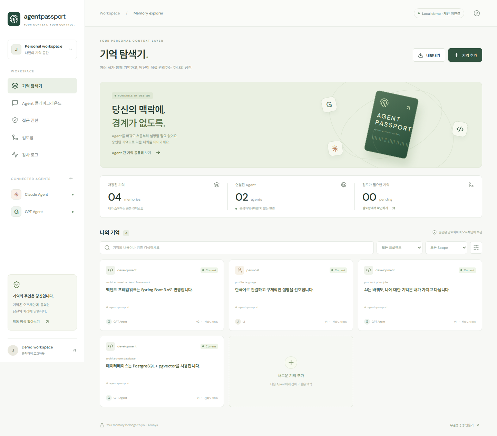

# Agent Passport

**AI는 바꿔도, 나에 대한 기억은 내가 가지고 다닌다.**

`Agent_Passport_BlockAI26_기획서.pdf` 23쪽 전체를 기준으로 만든 반응형 프로토타입과 실행 가능한 MVP입니다. React 대시보드에서 기억을 승인하고, 다른 Agent가 같은 기억을 조회하며, READ를 철회하면 서버가 다음 요청부터 차단합니다.

## 문서와 첫 사용 안내

- **[처음 사용하는 방법](docs/quickstart-ko.md)**: Codex 저장 → 대시보드 승인 → Claude 조회를 그대로 따라 하기.
- **[전체 문서 안내](docs/README.md)**: 파싱·저장·기억 선별·RAG·블록체인·긴 세션 설계.
- **[현재 적용 상태](docs/current-state.md)**: 구현/검증/미구현 구분.
- **[다음 구현 순서](docs/roadmap.md)**: 빠진 기능과 완료 기준.

현재 실행은 로컬 DB·SQL 권한·lexical 검색입니다. 실제 Codex/Claude MCP는 검증했지만, 대화 자동 수집·기억 자동 선별·긴 세션 체크포인트는 아직 구현되어 있지 않습니다.



## 실제 Codex / Claude Code 연결 검증 완료

실제 로그인된 **Codex CLI ↔ Claude Code**에서 MCP를 통한 양방향 기억 공유와 권한 철회 차단을 검증했습니다. 아래 명령으로 연결된 새 클라이언트를 사용할 수 있습니다.

```bash
npm run agent:codex
npm run agent:claude
```

각각 별도 터미널에서 실행합니다. [실제 클라이언트 연결 안내와 검증 증거](docs/real-clients.md)를 참고하세요. 이 검증은 기존 CLI 로그인으로 수행했으며, 아래 Playground API-key adapter 검증과는 구분됩니다.

## 바로 실행

GitHub에서 처음 받는 경우 Linux x64/WSL과 Node.js 20.19 이상을 준비하세요.

```bash
git clone https://github.com/sdd1234/agent-passport.git
cd agent-passport
bash scripts/setup.sh
npm run dev
```

브라우저에서 **http://localhost:5173** → **데모 시작하기**.

새 Linux/WSL 환경에서는 Node.js 20.19 이상이 있는 상태에서 다음을 실행합니다. 시스템 관리자 권한 없이 프로젝트 `.tools`에 Java 21/Maven을 준비합니다.

```bash
bash scripts/setup.sh
npm run dev
```

`Ctrl+C`로 종료합니다. 로컬 파일 DB와 암호화 키는 `.data/`에 저장됩니다. 키를 잃으면 해당 DB의 기억 원문을 복구할 수 없습니다. API 로그는 `.data/api.log`입니다. Windows에서는 WSL 터미널에서 실행하고 Windows 브라우저로 위 주소를 여세요.

## 90초 시연

1. **빈 데모 공간에서 데모 시작하기**: GPT/Claude, 4개 기억, Node.js → Spring Boot 변경 후보가 생성됩니다. 이미 사용한 DB에는 기존 결과가 남으므로 첫 화면이 다를 수 있습니다.
2. **검토함**: Spring Boot 변경을 승인합니다. 기존 Node.js는 v1, Spring Boot는 v2가 됩니다.
3. **Agent 플레이그라운드** → Claude: `우리 프로젝트 기술 스택 알려줘.` → 공통 기억의 Spring Boot/PostgreSQL을 표시합니다.
4. **접근 권한** → Claude `development READ`를 끕니다.
5. Claude에서 같은 질문 → `MEMORY_SCOPE_DENIED`에 따른 접근 차단을 표시합니다.
6. READ를 다시 켜면 조회가 가능합니다.
7. 기억 카드를 열어 Current/Superseded 이력, 감사 로그의 DENY를 확인합니다.

GPT 패널의 `프로젝트 스택 기억하기`로 후보를 새로 생성할 수도 있습니다. 모든 후보는 검토함 승인 전에는 검색되지 않습니다. 각 채팅 요청은 이전 대화를 재전송하지 않아, 화면상 대화 이력으로 기억 공유가 가장되는 것을 방지합니다.

## 구현 범위와 실행 모드

| 항목 | 로컬 데모 | 실제 연동 모드 |
| --- | --- | --- |
| UI | 반응형 React/TypeScript 5개 화면 | 동일 |
| API/저장 | Spring Boot 3.5 + H2 파일 DB | Spring Boot + PostgreSQL |
| 원문 | AES-256-GCM 암호화 | AES-256-GCM 암호화 |
| 기억 추출 | Spring Boot/Node.js/PostgreSQL 시연 규칙 | 선택한 OpenAI/Anthropic API로 JSON 후보 추출 |
| 응답 | 검색된 기억을 보여주는 시뮬레이터 | OpenAI Responses / Anthropic Messages |
| 검색 | lexical + metadata ranking | pgvector cosine + metadata ranking |
| 로그인 | 명시적 로컬 데모 로그인 또는 지갑 | SIWE 지갑 서명 + HttpOnly 세션 |
| 권한 | 로컬 영속 DB, 서버 강제 검사 | 지갑 트랜잭션 + EVM 계약 상태 직접 검사 |
| 무결성 | salted Merkle root 로컬 생성 | 지갑으로 root 앵커 기록 및 receipt 검증 |
| MCP | 실제 stdio MCP 서버/8개 도구 | 동일 Agent 토큰과 API로 권한 강제 |

**검증된 것**: 브라우저 시연, 백엔드 보안/버전 테스트, 실제 PostgreSQL/pgvector SQL, 로컬 EVM 계약과 live-mode API 통합, MCP 프로토콜 왕복.

**외부 설정이 필요한 것**: OpenAI/Anthropic 유료 API의 실제 응답, 실제 임베딩 품질, 공개 테스트넷 배포와 브라우저 지갑 연결. Playground용 API 키·모델 ID·테스트넷 지갑이 제공되지 않아 직접 API adapter를 호출하거나 공개 테스트넷에 배포하지 않았습니다. 실제 Codex/Claude Code는 기존 로그인으로 MCP 호출을 검증했습니다. 로컬 EVM 테스트와 고정 임베딩을 실제 공급자 성능으로 표시하지 않습니다. 목표 KPI(Recall ≥90%, conflict ≥85%, P95 <1.5s)의 실데이터 달성을 주장하지 않습니다.

## 실제 AI 연결

`.env.example`을 `.env`로 복사해 필요한 값을 설정합니다. 데모 실행만 할 때는 `.env`가 없어도 됩니다.

```dotenv
OPENAI_API_KEY=...
OPENAI_MODEL=사용할_모델_ID
ANTHROPIC_API_KEY=...
ANTHROPIC_MODEL=사용할_모델_ID
```

서버 재시작 후 Playground에서 **실제 API 사용**을 켭니다. 키는 브라우저에 전달되지 않습니다. API 오류는 오류로 표시하며 시뮬레이션으로 조용히 대체하지 않습니다. 모델 ID는 계정에서 사용 가능한 값을 지정합니다.

## PostgreSQL + pgvector

Docker가 설치된 환경에서는 다음으로 웹/API/DB를 실행할 수 있습니다.

```bash
cp .env.example .env
# .env의 DATABASE_PASSWORD를 변경하고 아래 출력값을 MEMORY_ENCRYPTION_KEY에 입력
openssl rand -base64 32
docker compose --env-file .env -f infra/docker-compose.yml up --build
```

웹 주소는 동일하게 http://localhost:5173 입니다. 개발 서버와 동시에 같은 포트로 실행하지 마세요.

벡터 검색은 PostgreSQL에서 다음을 설정한 뒤 서버를 재시작합니다.

```dotenv
SEARCH_MODE=vector
OPENAI_API_KEY=...
EMBEDDING_MODEL=text-embedding-3-small
```

벡터 모델은 1536차원 `dimensions` 요청을 지원해야 합니다. 승인 시 임베딩을 생성하고 PostgreSQL에 저장합니다. 임베딩 실패 시 승인은 롤백되어 후보가 유지됩니다. 새 DB의 승인 흐름으로 vector 기능을 검증할 수 있습니다. 기존 데이터의 일괄 재색인/이전은 미구현이며, 같은 내용 재저장은 duplicate가 되어 재색인을 보장하지 않습니다. H2에서는 `SEARCH_MODE=lexical`을 사용합니다. 벡터 검색은 승인된 내용을 임베딩 공급자에게 보내므로 해당 설정을 사용자가 선택해야 합니다.

## 지갑 + EVM

```bash
# 로컬 개발 체인 (테스트 전용 지갑)
npx ganache --server.host 127.0.0.1 --chain.chainId 31337
# 다른 터미널: 첫 unlocked 로컬 테스트 계정으로 배포
npm run contracts:deploy
```

출력된 계약 주소를 설정합니다.

```dotenv
APP_MODE=live
EVM_RPC_URL=http://127.0.0.1:8545
CHAIN_ID=31337
REGISTRY_ADDRESS=배포한_계약_주소
MEMORY_ENCRYPTION_KEY=32바이트_키의_base64
```

서버 재시작 → 브라우저 지갑 네트워크를 Chain ID 31337로 설정 → **지갑으로 로그인** → GPT/Claude Agent 등록 → 접근 권한에서 READ/WRITE 부여. 새 지갑의 기억 공간은 비어 있습니다. 새 Agent는 기본 차단 상태입니다.

공개 EVM 테스트넷은 RPC/CHAIN_ID와 테스트용 DEPLOYER_PRIVATE_KEY를 설정한 후 같은 배포 스크립트를 사용합니다. `.env`와 `contracts/deployment.json`은 버전 관리에서 제외됩니다. 계약에는 원문과 scope 이름이 아닌 사용자별 salted scope hash, 권한, 만료, Merkle root만 저장됩니다.

Live 권한 동기화 API는 실제 성공 receipt, 발신 지갑, 계약 주소, calldata, chain ID를 검증합니다. 검색은 매번 계약을 읽기 때문에 DB 캐시를 수정해도 권한을 얻을 수 없으며, RPC 장애 시 허용하지 않습니다. 이 단순한 MVP 방식은 요청량이 클 때 event cache보다 느릴 수 있습니다.

## MCP 연결

대시보드 왼쪽 `CONNECTED AGENTS +` → MCP Client / IDE 등록 → 한 번 표시되는 토큰을 저장 → 필요한 scope 허용.

```json
{
  "mcpServers": {
    "agent-passport": {
      "command": "node",
      "args": ["/home/sinclair/agent-passport/apps/mcp-server/dist/index.js"],
      "env": {
        "PASSPORT_API_URL": "http://127.0.0.1:8080",
        "PASSPORT_AGENT_TOKEN": "발급받은_Agent_토큰"
      }
    }
  }
}
```

지원 도구: `search_memory`, `get_project_context`, `save_memory`, `propose_memory`, `update_memory`, `list_memory_versions`, `list_scopes`, `request_scope_access`.

`save_memory`도 승인이 필요한 후보를 만듭니다. `request_scope_access`는 소유자의 UI 승인 안내를 반환하며 스스로 권한을 획득하지 않습니다. MCP는 stdio 방식입니다. Remote HTTP MCP/OAuth 서버는 이번 구현에 포함하지 않았고, 실제 AI Playground는 문서에 허용된 backend adapter 경로를 사용합니다.

## 검증

새 복제본 독립 검증 결과와 재현 방법: [clean-clone-verification.md](docs/clean-clone-verification.md). `npm run verify:local`은 별도 포트와 새 DB에서 빌드·Java·계약·브라우저·MCP 테스트를 실행하며, 실패를 생략하지 않습니다. Chromium과 OS 라이브러리는 먼저 설치해야 합니다.

```bash
npm run build
source scripts/java-env.sh
mvn -q -f apps/api/pom.xml test
npm run test:contracts
# npm run dev 실행 상태에서
npx playwright install chromium
npm run test:e2e
node scripts/test-mcp.mjs
```

이 WSL의 Chromium은 시스템에 없는 NSS/NSPR 라이브러리를 프로젝트 `.tools/browser-libs`에서 사용합니다.

```bash
LD_LIBRARY_PATH="$PWD/.tools/browser-libs/usr/lib/x86_64-linux-gnu" npm run test:e2e
```

PostgreSQL/pgvector + live API/EVM 통합 테스트는 [통합 검증 안내](docs/testing.md)를 참고하세요. [검증 결과](docs/integration-results.json)에는 실제 검증과 외부 미검증 항목을 구분했습니다.

## 구조

```text
apps/web/           React 대시보드 / 지갑 UI
apps/api/           Spring Boot 인증, 권한, 기억, 버전, AI adapter, 검색
apps/mcp-server/    TypeScript stdio MCP / Agent 토큰 바인딩
contracts/         Solidity registry / 배포 / 실제 EVM 테스트
infra/             Docker Compose / nginx / Dockerfiles
scripts/           실행 / 설치 / 통합 테스트
eval/browser/      실제 브라우저 시연 테스트
docs/              기획서 추출문 / 설계 / 화면 / 검증 결과
```

[기획서 요구사항 대응표](docs/requirements.md) · [아키텍처](docs/architecture.md) · [API 명세](docs/api.md) · [공식 참고 문서](docs/references.md)
