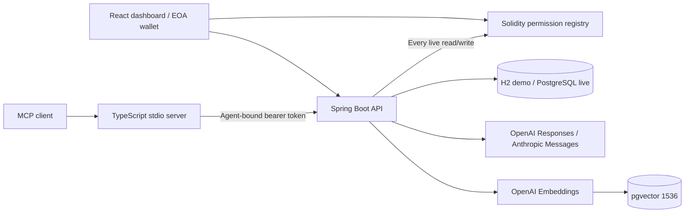

# Architecture

Owner sessions are only used for owner UI actions. Bearer credentials identify exactly one registered owner/agent; the API never trusts a user-supplied agent ID to override a credential. Default permission is deny. All agent retrieval paths, including version history and MCP tools, enforce READ. Proposals and updates enforce WRITE. Owner approval cannot be performed with an agent token.

Memory versions are append-only through the API. A unique `(owner, project, scope, canonical_key)` selects the canonical item. Approvals compare the proposal's expected version under a transaction. The current version pointer advances while old version content/hash/source/time remain intact. Conflicting and sensitive proposals remain outside retrieval until the owner approves. Deletion explicitly removes content-bearing versions, proposals and embeddings.

Demo permissions persist in SQL. Live permissions are read from `hasAccess` on every operation, with fail-closed RPC errors. Grant/revoke UI first waits for the owner's transaction, then sends the hash; API verifies successful receipt, chain ID, sender, target and exact calldata before updating display metadata. Direct wallet revocation is reflected without waiting for API synchronization.

Plain memory text and proposal JSON use AES-256-GCM with random 96-bit IVs. Agent secrets are SHA-256 hashed in DB, returned only at registration. Memory salts never go on chain. Scope commitments include a per-owner random salt; Merkle leaves commit to memory ID, version and content hash with that salt. Root submission is immutable per owner and batch. Hashes alone do not prove that a memory's factual claim is true.

The pgvector path performs SQL owner/scope/project/current/validity filtering, computes cosine similarity, then applies metadata ranking. The demo uses lexical similarity instead. The API context assembler limits provider input to 16,000 characters of memory JSON. Provider requests do not send older chat history; each answer is based on the present question and freshly authorized context.

The initial project uses synchronous indexing during approval so a failed embedding cannot silently create an unindexed approved version. A worker queue is a future throughput improvement. External provider calls have connect/request timeouts and do not fall back silently to a fake result.
