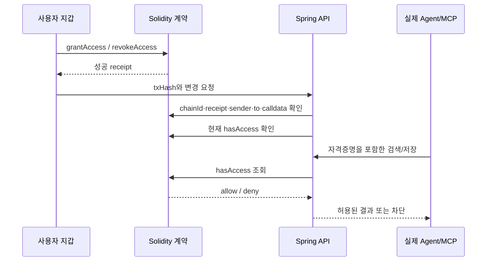

# 블록체인의 역할과 실제 사용 상태

## 지금 사용하는가

현재 API는 `APP_MODE=demo`, `REGISTRY_ADDRESS` 미설정입니다. 대시보드의 권한 변경은 SQL `permissions`에 반영되고, 계약 호출이나 트랜잭션은 발생하지 않습니다. 화면의 Local demo 표시는 이 상태를 뜻합니다.

**계약이 없는 것은 아닙니다.** [MemoryPermissionRegistry.sol](../contracts/src/MemoryPermissionRegistry.sol)과 [Chain.java](../apps/api/src/main/java/dev/passport/Chain.java)에 live 경로가 구현되어 있고, 로컬 Ganache EVM에 실제 배포해 grant/revoke/expiry/anchor를 검증했습니다. [검증 결과](integration-results.json)는 공개 테스트넷 결과가 아닙니다.

## 무엇을 체인에 기록하는가

| 데이터 | 위치 |
| --- | --- |
| 기억 내용·후보·대화 근거 | 오프체인 DB (현재 대화 전문 수집은 없음) |
| embedding | 오프체인 PostgreSQL |
| 프로젝트·Scope 이름 | 오프체인 metadata |
| owner별 Agent·scopeHash 권한 | Solidity grants mapping |
| READ/WRITE·만료·철회 | 계약 상태와 이벤트 |
| 기억 배치 Merkle root | owner별 roots mapping과 이벤트 |

Scope hash는 `keccak256(owner + ':' + ownerSalt + ':' + scope)`입니다. 단순 공개 Scope 문자열 hash보다 추측이 어렵게 owner별 salt를 사용합니다. salt 자체는 DB에 있고 온체인에 보내지 않습니다. 공개 체인의 owner 주소·시각·변경 빈도 등 모든 메타데이터를 숨기는 설계는 아닙니다.

## 현재 live 권한 경로



권한은 `(owner, agentHash, scopeHash)` 기준이며 READ=1, WRITE=2, 둘 다=3입니다. 계약 함수의 `msg.sender`에 소유권을 묶어서 다른 지갑이 해당 owner의 권한을 바꿀 수 없게 했습니다. Agent 자격증명과 owner 관계는 오프체인 API 등록으로 관리합니다.

매 Agent 요청에서 RPC로 현재 권한을 확인합니다. event cache는 아직 없어서 DB 캐시를 조작해도 live READ를 허용할 수 없지만, RPC 지연이 검색 지연에 추가됩니다. RPC 장애 시 거절합니다. 만료 경계는 `block.timestamp < expiresAt`입니다.

## Merkle anchor

현재 구현은 사용자가 요청한 시점에 owner의 기억 버전 hash를 모읍니다.

```text
content_hash = SHA-256(기억 내용)
leaf = keccak256(memory_id + ':' + version + ':' + content_hash + ':' + owner_salt)
root = 정렬한 leaf와 정렬한 pair로 구성한 Merkle tree의 root
```

사용자가 지갑으로 `anchorMemoryRoot(batchId, root)`를 호출하면 API가 성공 트랜잭션과 계약 root를 확인합니다. 같은 owner/batch의 root는 덮어쓸 수 없습니다. 자동 주기 배치 worker, 개별 기억 Merkle proof 다운로드/검증 UI는 아직 없습니다.

이 증명은 해당 커밋된 내용과 일치하는지 비교할 근거를 제공합니다. 발언의 사실성, 추출의 정확성, 모든 metadata의 무결성을 자동 보증하지 않습니다. 현재 content hash는 기억 내용에 대한 것이므로 출처 metadata까지 완전하게 커밋한다고 설명하면 안 됩니다.

## 제공하는 보장과 한계

- 체인에서 사용자가 승인/철회한 권한을 외부에서 검증할 근거가 생김.
- 원문을 공개하지 않고 내용 버전의 커밋을 남길 수 있음.
- API 서버가 정책을 실행하는 구조이며, 체인이 DB를 직접 암호학적으로 잠그는 것은 아님.
- 이미 Agent에게 전달한 원문을 회수하거나 지우지 못함. 철회는 이후 조회/저장을 제한.
- 운영자에 대한 신뢰를 완전히 제거하지 않음. 복호화 권한, 가용성, 원문 삭제, 정직한 권한 실행은 여전히 운영 경계에 있음.
- client-side encryption, 독립 proof 검증, 이벤트 동기화·reorg 정책은 추가 설계 대상.

## 실제 환경으로 활성화하는 조건

배포 절차는 [루트 README](../README.md)의 지갑/EVM 부분을 따릅니다. 코드 설정은 `APP_MODE=live`, `EVM_RPC_URL`, `CHAIN_ID`, `REGISTRY_ADDRESS`, `MEMORY_ENCRYPTION_KEY`입니다. 실제 지갑으로 로그인한 owner 공간에서 새 Agent를 등록하고 사용자 지갑으로 권한을 부여합니다.

기존 demo-owner의 기억·토큰은 지갑 owner로 자동 이전되지 않습니다. 단순히 APP_MODE만 바꾸면 기존 demo 토큰이 지갑 주소 기반 권한과 일치하지 않으므로 별도 등록/이전 설계가 필요합니다.

공개 테스트넷에 대해서는 계약 배포, 지갑 UI, receipt 확인, 직접 지갑 revoke 후 차단, 만료, RPC 실패, anchor 확인을 별도로 테스트해야 합니다. local EVM 통과를 공개 테스트넷 완료로 표시하지 않습니다.
