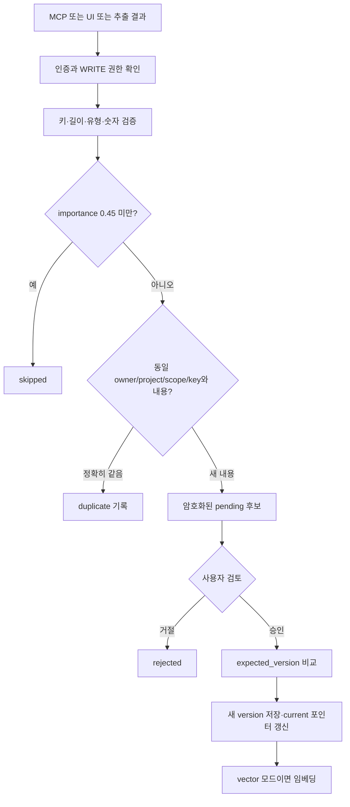

# 데이터 파싱과 기억 생명주기

이 문서는 현재 구현과 후속 설계를 분리합니다. 아래의 추가 테이블/이벤트/평가 정책은 **아직 코드에 적용되지 않았습니다**.

## 현재 입력 경로

### MCP

실제 Agent가 `save_memory`/`propose_memory`에 구조화된 JSON을 전달합니다. MCP SDK의 Zod 스키마와 API의 검증을 거쳐 후보로 저장합니다. 서버가 Codex/Claude의 대화 전문을 감시하거나 가져오는 기능은 없습니다.

입력은 `canonical_key`, `content`, `scope`, `project`, `type`입니다. MCP 서버는 `confidence=0.85`, `importance=0.8`, `validTo=0`을 넣습니다. 이 값은 측정된 품질·신뢰도 점수가 아닙니다. `sourceAgent`는 인증된 Agent로 서버가 정합니다.

### Playground

- demo: Spring Boot/Node.js/PostgreSQL 포함 여부를 확인하는 시연 규칙.
- 실제 API 선택: 현재 사용자 메시지에서 최대 8개 기억을 JSON 배열로 추출하도록 공급자 모델에 요청. 반환 JSON을 파싱하고 필드를 검증.
- 대화 전체 이력, tool execution evidence, 원본 메시지 ID는 입력에 포함되지 않음.
- JSON 형식 요청+서버 검증은 있으며, 공급자의 native structured-output schema 강제는 아직 없음.

### 수동 UI

사용자가 기억 키/내용/Scope/프로젝트/유형을 작성합니다. 동일한 후보·승인 경로를 사용합니다. 제품에 PDF/파일 업로드 importer는 없습니다. 기획서 전체 추출문은 개발 산출물입니다.

## 현재 저장 흐름



승인과 버전/벡터 저장은 같은 트랜잭션에서 수행됩니다. 임베딩 실패는 승인을 롤백합니다. 같은 키에 대한 동시 변경은 `expected_version` 불일치 시 거절하며, 사용자가 다시 제안해야 합니다. 의미가 같은 다른 문장/다른 키를 자동 병합하지 않습니다.

## 데이터 위치와 삭제

| 정보 | 현재 테이블 | 암호화/정책 |
| --- | --- | --- |
| 사용자/owner salt | users | salt는 체인에 공개하지 않음 |
| Agent 등록·토큰 hash | agents | 토큰 원문은 등록 시 한 번 반환 |
| 기억 분류·현재 버전 | memories | project/key/scope는 메타데이터로 존재 |
| 원문·버전·hash·출처 | versions | content AES-GCM 암호화 |
| 저장/변경 후보 | proposals | payload AES-GCM 암호화 |
| 감사 이벤트 | audit | 원문 대신 행위·ID·판정 기록 |
| 임베딩 | memory_embeddings | PostgreSQL vector mode에서만 생성 |

기억 삭제는 관련 후보·버전과 현재 설정에서 활성화된 벡터 삭제 경로를 호출합니다. **vector→lexical 모드 변경 후 남아 있는 embedding의 일관된 정리까지는 운영 보완이 필요합니다.** 감사 metadata/이미 체인에 기록한 root는 삭제 대상이 아닙니다. 백업 보존/삭제는 아직 자동화되지 않았습니다.

## 추가 설계: 공통 이벤트 입력

사용자가 허용한 소스만 adapter로 받습니다. MCP 수동 저장은 계속 지원합니다. 제품 대화, 명시적 import, 클라이언트가 제공하는 연동 이벤트를 같은 형식으로 정규화하는 것이 목표입니다. 각 CLI의 자동 이벤트 제공 여부/권한은 구현 전에 검증해야 하며 무조건 접근 가능하다고 전제하지 않습니다.

제안 이벤트 예시(현재 API 스키마 아님):

```json
{
  "event_id": "소스에서 안정적으로 식별되는 ID",
  "owner_id": "서버 인증에서 결정",
  "agent_id": "등록 자격증명에서 결정",
  "session_id": "세션 ID",
  "source_message_id": "메시지/작업 이벤트 ID",
  "role": "user",
  "occurred_at": "원본 발생 시각",
  "project": "agent-passport",
  "scope": "development",
  "content": "백엔드는 Spring Boot로 확정했어."
}
```

- `(owner, source, event_id)`를 멱등성 키로 사용해 재전송을 중복 처리하지 않음.
- `occurred_at`과 서버 수신 시각을 분리해 뒤늦게 온 이벤트로 최신 결정을 덮지 않음.
- 처리 cursor/checkpoint는 성공한 이벤트까지만 전진. 실패는 제한 재시도와 실패 목록으로 처리.
- 원본 retention은 명시적 정책으로 관리. 원문 전체를 무조건 영구 저장하지 않음.
- 원문이 보존된 경우 근거 구간을 연결하고, 삭제된 경우 증거 가용성 상태를 표시.

## 추가 설계: 기억 선별 정책

| 입력 유형 | 의도한 처리 | 근거 |
| --- | --- | --- |
| 명시적 확정/변경 | decision 후보 | “확정”, “앞으로”, “변경”과 대상이 명확 |
| 지속적인 선호 | preference 후보 | 여러 세션에서 유효한 사용자 요청 |
| 일회성 출력 지시 | 세션 상태로만 유지 | “이번만” 같은 범위 제한 |
| 가정/검토 질문 | 미확정 작업 상태 또는 제외 | “써볼까?”를 확정으로 승격하지 않음 |
| Agent 추측 | 사실 후보로 자동 승격 금지 | 사용자/도구 근거 필요 |
| 진행 완료 | evidence가 있는 progress | 실제 작업 이벤트와 연결 |
| API 키/비밀번호 | 장기 기억 금지·탐지/마스킹 | 중요도 점수와 무관하게 배제 |
| 민감한 개인 사실 | explicit opt-in + 사용자 승인 | project scope로 잘못 유출되지 않게 분류 |

하나의 중요도 숫자에 의존하지 않고 `명시성/지속성/재사용성/근거/민감성/만료`를 분리해 기록하는 설계입니다. LLM이 반환한 점수는 신뢰도 보증이 아니며, 사용자 승인/평가셋으로 보완합니다. 낮은 신뢰도 후보는 검토함에 이유와 근거를 함께 표시합니다.

## 추가 설계: canonical memory

- 단위: 독립적으로 승인·변경·권한 제어 가능한 사실 하나.
- 키 예: `architecture.backend.framework`, `architecture.database`, `profile.language`.
- 같은 키·같은 정규화 값: 새 버전 대신 관찰 이력/출처 추가.
- 같은 키·다른 값: 명시적 변경인지 모순인지 검토. 단순 수신 시각만으로 승자 결정 금지.
- 다른 키·의미 유사: 의미 중복 후보로 제시. 자동 합치기는 평가 후 제한적으로 도입.
- 병존 가능한 사실: 별도 키/조건/유효기간으로 유지.

새로 필요한 schema 후보는 `source_events`, `processing_cursors`, `proposal_evidence`, `memory_observations`입니다. DB migration과 원문 삭제 전파를 함께 설계해야 합니다.

## 완료 기준

1. 같은 이벤트 재전송 시 후보가 중복 생성되지 않음.
2. 가정·부정·일회성 지시가 확정된 장기 사실로 저장되지 않음.
3. 후보마다 출처 메시지/작업 근거와 처리 이유를 확인할 수 있음.
4. 원문 삭제/권한 철회가 이후 추출·검색·재시도 작업에도 반영됨.
5. 평가셋에서 오저장/누락을 유형별로 측정하고 실패 예시를 남김.
