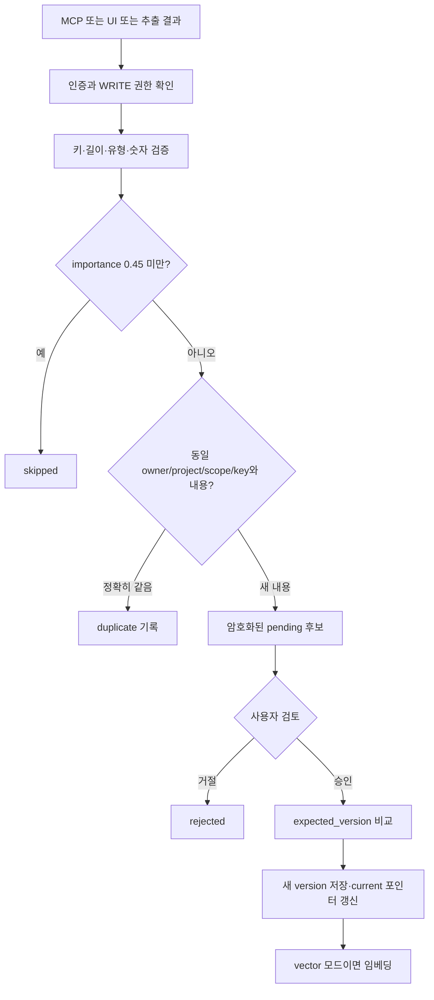
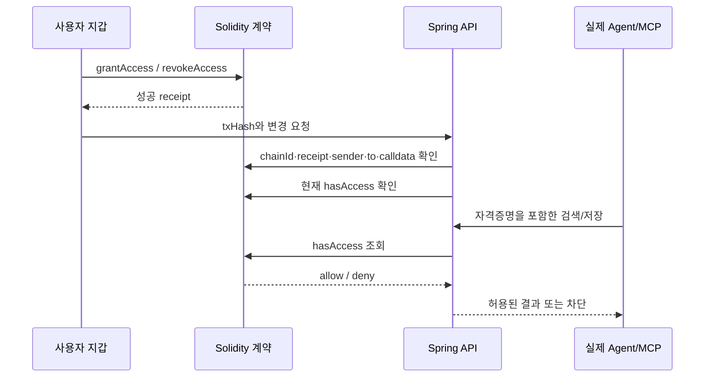
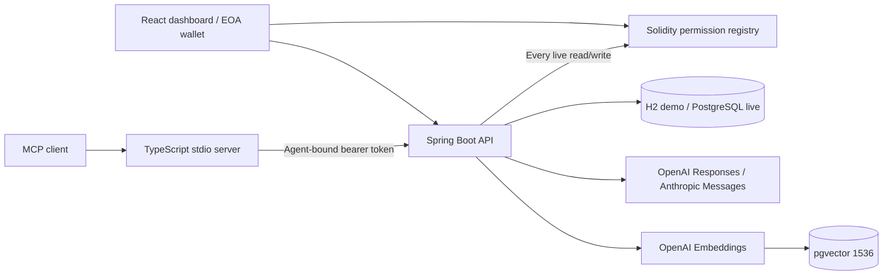

# Agent Passport 통합 문서

작성 기준: 2026-09-14. 현재 구현·검증 범위와 추가 설계를 구분한 문서입니다. 처음 사용하는 순서부터 데이터 파싱, 저장, 기억 선별, RAG, 블록체인, 긴 세션, API와 검증을 함께 정리했습니다.

개별 문서는 [문서 안내](README.md)를 참고하세요. 아래 추가 설계는 이미 적용된 기능이 아닙니다.

---

원본: [quickstart-ko.md](quickstart-ko.md)

## 처음 사용하는 방법

목표는 **Codex에게 기억을 맡기고 → 내가 승인하고 → 새 Claude 세션에서 같은 기억을 읽는 것**입니다. 현재 환경에 준비된 연결을 기준으로 설명합니다.

### 1. Windows에서 WSL 터미널 열기

Windows Terminal의 Ubuntu/WSL 탭을 엽니다. PowerShell에서 시작한다면 먼저 다음을 실행합니다.

```powershell
wsl
```

이후 명령은 WSL에서 실행합니다.

```bash
cd /home/sinclair/agent-passport
```

### 2. 서버와 대시보드 확인

브라우저에서 [http://localhost:5173](http://localhost:5173)을 엽니다. 열리면 이미 실행 중이므로 서버를 하나 더 시작하지 않습니다.

열리지 않으면 WSL 터미널에서:

```bash
cd /home/sinclair/agent-passport
npm run dev
```

이 터미널은 켜 두세요. 웹 준비 메시지 후 API 시작까지 잠시 기다렸다가 브라우저를 새로고침합니다. 서버 확인:

```bash
curl http://127.0.0.1:8080/api/health
```

대시보드에서 **데모 시작하기**를 누릅니다. 이미 로그인되어 있으면 바로 화면이 나타납니다. 이번 실제 CLI 연결은 `demo-owner` 공간에 등록되어 있으므로 지갑 로그인으로 다른 공간에 들어가면 같은 기억/Agent가 보이지 않습니다.

### 3. Codex를 연결해서 실행

새 WSL 터미널을 열어 다음을 실행합니다.

```bash
cd /home/sinclair/agent-passport
npm run agent:codex
```

현재 열려 있는 이 대화에 MCP가 자동 추가되는 방식이 아닙니다. 위 명령으로 실행한 새 Codex CLI에 연결됩니다. 일반 클라이언트가 작업 공간/도구 승인을 표시하면 실제 실행 대상이 Agent Passport인지 확인합니다.

아래 요청을 복사해서 Codex에 입력하세요.

> Agent Passport의 save_memory 도구를 호출해줘. canonical_key는 demo.handoff.note, content는 "Agent Passport의 이번 시연 이름은 파란여권이다.", project는 passport-first-use, scope는 development, type은 project_fact로 저장 후보를 만들어줘. 파일 수정이나 터미널로 저장하지 말고 MCP 도구를 사용해줘.

성공하면 `pending`과 후보 ID가 표시됩니다. 아직 다른 Agent에게 검색되는 상태는 아닙니다.

### 4. 대시보드에서 승인

1. [대시보드](http://localhost:5173)에서 **검토함**으로 이동합니다.
2. `demo.handoff.note` 후보의 내용과 출처 `Codex CLI (실제)`를 확인합니다.
3. **승인하기**를 누릅니다.
4. **기억 탐색기**에서 프로젝트 필터를 `passport-first-use`로 선택하면 기억을 확인할 수 있습니다.

검토함에 바로 보이지 않으면 브라우저를 새로고침합니다. 외부 MCP 요청에 대한 화면 실시간 push는 구현되어 있지 않습니다.

### 5. Claude에서 같은 기억 검색

다른 WSL 터미널을 열어 다음을 실행합니다.

```bash
cd /home/sinclair/agent-passport
npm run agent:claude
```

Claude에 아래 요청을 입력합니다. 정답인 시연 이름은 알려주지 않습니다.

> Agent Passport의 search_memory 도구로 project=passport-first-use, scope=development에서 demo.handoff.note를 찾아줘. 이번 시연 이름이 무엇인지 저장된 내용과 source_agent를 근거로 답해줘. 파일이나 이전 대화에서 추측하지 말고 MCP로 조회해줘.

Claude가 "파란여권"을 조회하고 출처가 Codex로 저장되어 있으면 공유가 된 것입니다. Codex와 Claude 사이에 대화를 복사해서 붙여 넣을 필요가 없습니다.

### 6. 접근 차단 확인

1. 대시보드의 **접근 권한**으로 이동합니다.
2. **Claude Code (실제)** 열의 `development READ`를 끕니다. `Claude Agent`는 Playground용 별도 Agent이므로 구분하세요.
3. Claude에게 "같은 조건으로 search_memory를 다시 호출하고 이번 도구 결과를 보여줘"라고 요청합니다.
4. 도구 결과가 `MEMORY_SCOPE_DENIED`이면 서버 차단이 작동한 것입니다.
5. 사용을 계속하려면 READ를 다시 켭니다.

이미 응답으로 전달된 사실을 Claude가 대화 문맥에서 기억할 수는 있습니다. 권한 철회는 이전 전달 내용을 지우는 기능이 아닙니다. 차단 여부는 **새 MCP 호출 결과**로 확인하거나 새 클라이언트 세션에서 확인하세요.

### 7. 수정·삭제·다음 세션

- 수정: 같은 프로젝트/Scope/키로 새로운 내용을 `save_memory`로 제안 → 검토함 승인. 기존 버전은 이력에 남습니다.
- 중복: 같은 키와 정확히 같은 내용을 반복 저장하면 새 후보 대신 duplicate가 나올 수 있습니다.
- 삭제: 기억 카드 열기 → **기억 삭제** → 확인. 내용·버전·관련 후보를 제거합니다.
- 새 세션: 같은 실행기로 다시 열고 `search_memory`로 프로젝트 기억을 요청합니다. 자동 세션 요약/복원은 아직 없습니다.
- 종료: Agent 터미널은 종료해도 DB 기억이 유지됩니다. 서버 종료는 서버 터미널에서 `Ctrl+C`입니다.

### 대시보드 채팅과 실제 CLI의 차이

이번 사용 순서는 **터미널의 실제 Codex/Claude + 대시보드의 승인/권한 화면**입니다. 대시보드 Playground의 기본 응답은 시뮬레이션이며 실제 CLI 세션이 아닙니다. Playground 직접 API를 켜려면 별도 API 키·모델 설정이 필요합니다.

현재 사용에는 임베딩 API 키나 테스트넷 지갑이 필요하지 않습니다. 기본 검색은 lexical, 권한은 로컬 SQL입니다. 실제 임베딩/체인은 [RAG 설계](rag-design.md), [블록체인 설계](blockchain-design.md), 루트 [README](../README.md)에 별도로 설명합니다.

### 자주 만나는 문제

| 증상 | 확인/해결 |
| --- | --- |
| 5173 포트 사용 중 | 이미 실행된 서버를 사용. 새 `npm run dev`를 반복하지 않음 |
| Start Agent Passport 오류 | 먼저 API 서버 실행, `/api/health` 확인 |
| Missing credentials | `.data/agent-connections.json` 필요. [토큰 등록 안내](real-clients.md) 참고 |
| INVALID_CREDENTIAL | DB를 초기화했거나 해당 Agent를 삭제했는지 확인. 새 토큰 발급 후 로컬 연결 파일 갱신 |
| MEMORY_SCOPE_DENIED | 해당 **실제 CLI Agent**의 Scope READ/WRITE와 만료 확인 |
| 검색 결과가 비어 있음 | 후보 승인 여부, project/scope 일치, 현재 버전/유효기간 확인 |
| 후보가 보이지 않음 | 대시보드 새로고침, `duplicate`/`skipped` 반환 여부, 로그인 공간 확인 |
| MCP 도구가 안 보임 | 실행기에서 연 새 세션인지 확인. 변경한 MCP 코드는 `npm run build -w apps/mcp-server` 후 클라이언트 재실행 |
| 로그인 필요 메시지 | 해당 CLI에서 정상 로그인 후 재실행. Passport 토큰과 모델 서비스 로그인은 별개 |
| CHAIN_UNAVAILABLE | live 권한 모드에서 RPC/계약 설정 확인. 현재 빠른 사용 안내는 demo 기준 |

새 PC에는 ZIP의 소스만 있으므로 `bash scripts/setup.sh`, CLI 설치·로그인, Agent 등록·토큰 설정이 별도로 필요합니다. DB나 키를 지우는 방식으로 오류를 해결하지 마세요. 기존 기억을 복구하지 못할 수 있습니다.

---

원본: [current-state.md](current-state.md)

## 현재 적용 상태

### 점검 결과

2026-09-14 문서화 시점에 `GET http://127.0.0.1:8080/api/health` 응답을 확인했습니다.

```json
{
  "status": "ok",
  "mode": "demo",
  "registry": "",
  "chainId": 31337,
  "providers": { "openai": false, "anthropic": false }
}
```

`chainId:31337`은 설정값입니다. `registry`가 비어 있으므로 현재 서버가 체인에 연결되어 있다는 증거가 아닙니다. `providers:false`는 Playground 직접 API 키·모델 설정 상태이며, 이미 로그인된 Codex CLI/Claude Code의 MCP 사용 가능 여부와는 별개입니다.

현재 구성은 H2 파일 DB, 로컬 SQL 권한, lexical 검색입니다. 실제 Codex·Claude 모델은 각각의 기존 로그인으로 MCP 서버를 호출했습니다.

### 적용·검증 구분

| 항목 | 구현 | 검증/현재 활성화 |
| --- | --- | --- |
| React 화면 5개 | 있음 | Explorer, Playground, 권한, 검토함, 감사 로그 검증 |
| stdio MCP 도구 8개 | 있음 | 실제 SDK client 및 실제 Codex/Claude 사용 검증 |
| Agent별 자격증명 | 있음 | token hash → owner/agent 바인딩, 위조 ID 차단 |
| 후보 저장·사용자 승인 | 있음 | 승인 전 검색 제외 검증 |
| 같은 키/내용 중복 억제 | 있음 | 정확히 같은 내용 기준, 의미 중복 병합은 없음 |
| 충돌 검토·이전 버전 보존 | 있음 | 낙관적 버전 검사, 동시 변경 충돌 거절 |
| 기억 내용 암호화 | 있음 | AES-256-GCM. 메타데이터 전체 암호화는 아님 |
| 직접 API로 기억 추출·응답 | 있음 | 별도 API-key adapter는 외부 실제 호출 미검증 |
| 일반적인 대화 자동 수집 | 없음 | Agent가 MCP를 호출한 내용만 들어옴 |
| 파일/PDF 업로드 파싱 | 없음 | 기획서를 개발 중 읽은 작업과 구분 |
| 데이터 기반 중요도 평가 | 부족 | MCP 경로 confidence=0.85, importance=0.8 고정 |
| PostgreSQL/pgvector 검색 | 있음 | 실제 SQL+고정 벡터 테스트. 현재 서버는 비활성 |
| 실제 임베딩 모델 품질 | 미검증 | 실제 API 임베딩·한국어 검색 평가 미실행 |
| Solidity registry/anchor | 있음 | 실제 로컬 EVM 배포·호출 검증. 현재 서버는 비활성 |
| 공개 테스트넷 배포 | 없음 | 배포 스크립트만 준비 |
| 대화 자동 요약·체크포인트 | 없음 | 설계 문서만 있음 |
| 새 세션 자동 복원 | 없음 | 사용자가 MCP 검색을 요청하면 공유 기억 조회 가능 |
| 모델별 토큰 예산 | 부족 | Playground만 기억 JSON 16,000자 제한 |
| 원격 HTTP MCP/OAuth | 없음 | 현재는 로컬 stdio 연결 |

### 설정은 서로 독립적

| 설정/경로 | 제어하는 것 | 자동으로 바뀌지 않는 것 |
| --- | --- | --- |
| `APP_MODE=demo/live` | 로그인·권한 검증/체인 경로 | DB 종류, 임베딩 모드, Agent 로그인 |
| `DATABASE_URL` | H2 또는 PostgreSQL | 체인과 모델 호출 |
| `SEARCH_MODE=lexical/vector` | 검색 유사도/임베딩 경로 | 블록체인 활성화 |
| Playground의 실제 API 사용 | OpenAI/Anthropic 직접 API 호출 | 외부 CLI의 로그인·모델 |
| `npm run agent:codex/claude` | 실제 CLI에 Passport MCP 추가 | 대화 전체 자동 기록·자동 승인 |

### 현재 저장 위치

로컬 실행의 작업 디렉터리는 프로젝트 루트입니다.

- 기억 DB: `/home/sinclair/agent-passport/.data/passport.mv.db`
- 개발용 암호화 키: `.data/encryption.key` (명시적 환경변수 키 사용 시 파일 생성 경로와 다를 수 있음)
- 실제 클라이언트용 토큰: `.data/agent-connections.json`
- API 로그: `.data/api.log`
- 검증용 원본 로그: `.data/real-clients/`
- PostgreSQL Compose 사용 시: `infra/docker-compose.yml`에 정의된 `postgres` Docker volume

`.data`와 `.env`는 배포 ZIP/Git에 포함하지 않습니다. ZIP은 소스·문서이며 기존 기억·로그인·토큰을 다른 PC에 복제하지 않습니다.

### 검증 결과를 읽는 방법

[실제 클라이언트 결과](real-client-results.json)는 서로 다른 새 세션에 정답 표식을 알려주지 않고 MCP로 조회했는지 검사합니다. 이 검증은 실제 모델 호출이지만 권한·저장 백엔드는 로컬 demo입니다.

[DB/체인 결과](integration-results.json)는 PostgreSQL, pgvector, 로컬 EVM과 live API를 사용했습니다. 임베딩은 고정 테스트 벡터여서 모델 검색 품질을 증명하지 않습니다.

일반 자동 테스트와 통합 테스트 통과가 운영 완료, 공개 테스트넷 배포, Recall 목표 달성을 뜻하지는 않습니다.

---

원본: [memory-lifecycle.md](memory-lifecycle.md)

## 데이터 파싱과 기억 생명주기

이 문서는 현재 구현과 후속 설계를 분리합니다. 아래의 추가 테이블/이벤트/평가 정책은 **아직 코드에 적용되지 않았습니다**.

### 현재 입력 경로

#### MCP

실제 Agent가 `save_memory`/`propose_memory`에 구조화된 JSON을 전달합니다. MCP SDK의 Zod 스키마와 API의 검증을 거쳐 후보로 저장합니다. 서버가 Codex/Claude의 대화 전문을 감시하거나 가져오는 기능은 없습니다.

입력은 `canonical_key`, `content`, `scope`, `project`, `type`입니다. MCP 서버는 `confidence=0.85`, `importance=0.8`, `validTo=0`을 넣습니다. 이 값은 측정된 품질·신뢰도 점수가 아닙니다. `sourceAgent`는 인증된 Agent로 서버가 정합니다.

#### Playground

- demo: Spring Boot/Node.js/PostgreSQL 포함 여부를 확인하는 시연 규칙.
- 실제 API 선택: 현재 사용자 메시지에서 최대 8개 기억을 JSON 배열로 추출하도록 공급자 모델에 요청. 반환 JSON을 파싱하고 필드를 검증.
- 대화 전체 이력, tool execution evidence, 원본 메시지 ID는 입력에 포함되지 않음.
- JSON 형식 요청+서버 검증은 있으며, 공급자의 native structured-output schema 강제는 아직 없음.

#### 수동 UI

사용자가 기억 키/내용/Scope/프로젝트/유형을 작성합니다. 동일한 후보·승인 경로를 사용합니다. 제품에 PDF/파일 업로드 importer는 없습니다. 기획서 전체 추출문은 개발 산출물입니다.

### 현재 저장 흐름



승인과 버전/벡터 저장은 같은 트랜잭션에서 수행됩니다. 임베딩 실패는 승인을 롤백합니다. 같은 키에 대한 동시 변경은 `expected_version` 불일치 시 거절하며, 사용자가 다시 제안해야 합니다. 의미가 같은 다른 문장/다른 키를 자동 병합하지 않습니다.

### 데이터 위치와 삭제

| 정보 | 현재 테이블 | 암호화/정책 |
| --- | --- | --- |
| 사용자/owner salt | users | salt는 체인에 공개하지 않음 |
| Agent 등록·토큰 hash | agents | 토큰 원문은 등록 시 한 번 반환 |
| 기억 분류·현재 버전 | memories | project/key/scope는 메타데이터로 존재 |
| 원문·버전·hash·출처 | versions | content AES-GCM 암호화 |
| 저장/변경 후보 | proposals | payload AES-GCM 암호화 |
| 감사 이벤트 | audit | 원문 대신 행위·ID·판정 기록 |
| 임베딩 | memory_embeddings | PostgreSQL vector mode에서만 생성 |

기억 삭제는 관련 후보·버전과 현재 설정에서 활성화된 벡터 삭제 경로를 호출합니다. **vector→lexical 모드 변경 후 남아 있는 embedding의 일관된 정리까지는 운영 보완이 필요합니다.** 감사 metadata/이미 체인에 기록한 root는 삭제 대상이 아닙니다. 백업 보존/삭제는 아직 자동화되지 않았습니다.

### 추가 설계: 공통 이벤트 입력

사용자가 허용한 소스만 adapter로 받습니다. MCP 수동 저장은 계속 지원합니다. 제품 대화, 명시적 import, 클라이언트가 제공하는 연동 이벤트를 같은 형식으로 정규화하는 것이 목표입니다. 각 CLI의 자동 이벤트 제공 여부/권한은 구현 전에 검증해야 하며 무조건 접근 가능하다고 전제하지 않습니다.

제안 이벤트 예시(현재 API 스키마 아님):

```json
{
  "event_id": "소스에서 안정적으로 식별되는 ID",
  "owner_id": "서버 인증에서 결정",
  "agent_id": "등록 자격증명에서 결정",
  "session_id": "세션 ID",
  "source_message_id": "메시지/작업 이벤트 ID",
  "role": "user",
  "occurred_at": "원본 발생 시각",
  "project": "agent-passport",
  "scope": "development",
  "content": "백엔드는 Spring Boot로 확정했어."
}
```

- `(owner, source, event_id)`를 멱등성 키로 사용해 재전송을 중복 처리하지 않음.
- `occurred_at`과 서버 수신 시각을 분리해 뒤늦게 온 이벤트로 최신 결정을 덮지 않음.
- 처리 cursor/checkpoint는 성공한 이벤트까지만 전진. 실패는 제한 재시도와 실패 목록으로 처리.
- 원본 retention은 명시적 정책으로 관리. 원문 전체를 무조건 영구 저장하지 않음.
- 원문이 보존된 경우 근거 구간을 연결하고, 삭제된 경우 증거 가용성 상태를 표시.

### 추가 설계: 기억 선별 정책

| 입력 유형 | 의도한 처리 | 근거 |
| --- | --- | --- |
| 명시적 확정/변경 | decision 후보 | “확정”, “앞으로”, “변경”과 대상이 명확 |
| 지속적인 선호 | preference 후보 | 여러 세션에서 유효한 사용자 요청 |
| 일회성 출력 지시 | 세션 상태로만 유지 | “이번만” 같은 범위 제한 |
| 가정/검토 질문 | 미확정 작업 상태 또는 제외 | “써볼까?”를 확정으로 승격하지 않음 |
| Agent 추측 | 사실 후보로 자동 승격 금지 | 사용자/도구 근거 필요 |
| 진행 완료 | evidence가 있는 progress | 실제 작업 이벤트와 연결 |
| API 키/비밀번호 | 장기 기억 금지·탐지/마스킹 | 중요도 점수와 무관하게 배제 |
| 민감한 개인 사실 | explicit opt-in + 사용자 승인 | project scope로 잘못 유출되지 않게 분류 |

하나의 중요도 숫자에 의존하지 않고 `명시성/지속성/재사용성/근거/민감성/만료`를 분리해 기록하는 설계입니다. LLM이 반환한 점수는 신뢰도 보증이 아니며, 사용자 승인/평가셋으로 보완합니다. 낮은 신뢰도 후보는 검토함에 이유와 근거를 함께 표시합니다.

### 추가 설계: canonical memory

- 단위: 독립적으로 승인·변경·권한 제어 가능한 사실 하나.
- 키 예: `architecture.backend.framework`, `architecture.database`, `profile.language`.
- 같은 키·같은 정규화 값: 새 버전 대신 관찰 이력/출처 추가.
- 같은 키·다른 값: 명시적 변경인지 모순인지 검토. 단순 수신 시각만으로 승자 결정 금지.
- 다른 키·의미 유사: 의미 중복 후보로 제시. 자동 합치기는 평가 후 제한적으로 도입.
- 병존 가능한 사실: 별도 키/조건/유효기간으로 유지.

새로 필요한 schema 후보는 `source_events`, `processing_cursors`, `proposal_evidence`, `memory_observations`입니다. DB migration과 원문 삭제 전파를 함께 설계해야 합니다.

### 완료 기준

1. 같은 이벤트 재전송 시 후보가 중복 생성되지 않음.
2. 가정·부정·일회성 지시가 확정된 장기 사실로 저장되지 않음.
3. 후보마다 출처 메시지/작업 근거와 처리 이유를 확인할 수 있음.
4. 원문 삭제/권한 철회가 이후 추출·검색·재시도 작업에도 반영됨.
5. 평가셋에서 오저장/누락을 유형별로 측정하고 실패 예시를 남김.

---

원본: [rag-design.md](rag-design.md)

## RAG·임베딩·벡터화 설계

### 현재 적용된 경로

`SEARCH_MODE=lexical`이 기본입니다. 실제 Codex/Claude 연결 검증도 이 모드로 수행했습니다. vector 코드는 PostgreSQL+pgvector에서 고정 테스트 벡터로 검증했지만 실제 임베딩 모델의 한국어 검색 품질은 평가하지 않았습니다.

현재 코드: [Embeddings.java](../apps/api/src/main/java/dev/passport/Embeddings.java), [MemoryService.java](../apps/api/src/main/java/dev/passport/MemoryService.java).

| 단계 | 현재 구현 |
| --- | --- |
| 저장 시점 | 사용자가 후보를 승인할 때 |
| 임베딩 입력 | 승인된 `content` 문자열 전체 |
| 단위 | `(memory_id, version)` 하나당 벡터 하나 |
| API | OpenAI `/v1/embeddings` |
| 모델 | `EMBEDDING_MODEL` 환경변수로 지정 |
| 차원 | 코드/DB 모두 1536으로 고정 |
| 질문 | 동일한 설정의 모델로 임베딩 |
| 유사도 | pgvector cosine distance를 `1 - distance`로 변환 |
| 필터 | owner, 허용 scope, project(지정 시), current, valid_to |
| 반환 개수 | 기본 8, 최대 12 |
| 제약 | 자동 청킹, 모델 버전 기록, 일괄 재색인, reranker, HNSW 없음 |

기억 원문은 암호화 저장되지만 임베딩 API에는 복호화한 텍스트를 보냅니다. 임베딩 벡터도 개인정보 특성이 남을 수 있는 데이터로 취급해야 하며 암호문이라고 설명하면 안 됩니다.

### 모델 설정

초기 설정안은 `text-embedding-3-small`/1536차원입니다. 이 모델의 기본 차원은 [OpenAI 임베딩 문서](https://developers.openai.com/api/docs/guides/embeddings)에 명시되어 있습니다. 모델 선택의 적합성은 별도 평가 대상입니다.

```dotenv
SEARCH_MODE=vector
OPENAI_API_KEY=...
EMBEDDING_MODEL=text-embedding-3-small
DATABASE_URL=jdbc:postgresql://127.0.0.1:5432/passport
DATABASE_USER=passport
DATABASE_PASSWORD=...
```

H2에서는 vector를 사용할 수 없습니다. 이 설정은 블록체인이나 실제 CLI 로그인과 독립적입니다. 실제 CLI가 Claude여도 저장/검색 임베딩은 Passport 백엔드에서 같은 모델로 처리합니다.

현재는 승인 트랜잭션 중 동기적으로 임베딩을 호출합니다. 실패하면 승인도 롤백되어 후보가 남습니다. 재시도·배치 처리 worker는 없습니다. 긴 호출이 승인 처리 지연으로 이어질 수 있습니다.

### 현재 검색 점수

```text
score = 0.55 × similarity
      + 0.15 × recency
      + 0.15 × importance
      + 0.10
      + 0.05 × confidence
```

- vector 모드 similarity: cosine similarity.
- lexical 모드 similarity: 공백으로 나눈 질문 단어가 content/key에 포함되는 비율.
- recency: 저장 시각 기준 30일 규모 지수 감쇠. 원문 발생 시각/사실의 유효성과 동일하지 않음.
- 0.10은 현재 공통 가산점. 실제 project match score가 아님. 프로젝트는 별도 필터로 처리.
- confidence/importance는 MCP 경로에서 고정값이므로 자동 평가 점수로 표시하면 안 됨.

현재 vector 모드는 lexical 점수를 함께 합치는 BM25+dense hybrid가 아닙니다. dense+metadata 정렬입니다. 낮은 관련도 결과를 제외하는 최소 점수 정책도 아직 없습니다. SQL 후보 유사도를 구한 뒤 앱에서 후보를 정렬하며 대규모 ANN 검색 최적화는 없습니다.

### 추가 설계: 벡터화 단위

**독립적으로 수정·삭제·승인·권한 부여할 수 있는 사실 하나를 한 기억으로 만든다.** 현재 이 정책을 자동 강제하는 파서는 없습니다.

예: "백엔드는 Spring Boot, DB는 PostgreSQL, 설명은 한국어"는 backend 결정, database 결정, language 선호의 3개 기억으로 나눕니다. 한 기억에 다른 Scope의 내용을 섞지 않습니다.

임베딩 텍스트 후보는 아래처럼 최소 의미 맥락을 포함한 안정적 형식으로 만들 수 있습니다. 현재는 content만 입력하므로 이 포맷은 추가 설계입니다.

```text
유형: 프로젝트 결정
대상: 백엔드 프레임워크
내용: Agent Passport 백엔드는 Spring Boot를 사용한다.
```

- 실제 project/owner/scope/권한은 metadata 필터에 남김. 텍스트의 프로젝트 언급으로 권한을 대신하지 않음.
- 모호한 대명사를 해소하되 원문에 없는 사실을 만들지 않음.
- 기술명/식별자는 원형을 보존하고 같은 key/value의 정규화 규칙을 고정.
- 버전 번호·검색 시각처럼 의미가 없는 가변 필드는 임베딩 텍스트에 넣지 않음.
- 입력 텍스트와 정규화 버전을 기록해 재현 가능한 재색인이 가능하게 함.

짧은 사실에는 문자 수 기준 분할보다 의미 단위 분리가 우선입니다. 긴 문서 importer를 추가할 때는 제목/문단/코드 구조를 유지한 청킹을 별도로 구현합니다. 300~500 tokens, 필요한 경우 약 50 tokens overlap은 초기 평가 후보일 뿐 확정된 최적값이 아닙니다. 문서 조각을 곧바로 확정된 사용자 사실로 승격하지 않습니다.

### 추가 설계: 모델 관리와 재색인

현재 DB는 모델 ID를 기록하지 않으므로 환경변수만 다른 모델로 바꾸면 같은 1536차원이어도 호환되지 않는 벡터가 섞일 수 있습니다. **모델 교체를 현재 지원 기능으로 안내하지 않습니다.**

추가할 정보:

- embedding model ID, dimensions, normalization/chunking version
- embedding input hash, 생성 시각, indexing status
- memory version 참조와 활성 인덱스 세대

전환 과정:

1. 새 모델/포맷으로 별도 인덱스 세대 생성.
2. 승인된 current 데이터부터 재색인, 원문 삭제/철회를 작업 시점에 재확인.
3. 실패/누락을 추적하고 전체 coverage 검사.
4. 질의 임베딩 설정과 인덱스 세대를 함께 전환.
5. 평가 통과 후 구 인덱스 정리. 실패 시 구 세대로 복귀.

현재는 기존 H2 데이터 이전·일괄 재색인 기능이 없습니다. 단순히 같은 내용을 다시 저장하면 duplicate가 되므로 재색인을 보장하지 않습니다. 새 DB로 vector 기능을 검증하는 것과 기존 데이터의 운영 전환을 구분해야 합니다.

### 추가 설계: retrieval와 컨텍스트

1. 인증/권한/유효기간 필터를 우선 적용.
2. key/기술명 exact·lexical 검색과 dense 검색에서 후보 확보.
3. 초기에는 RRF 같은 후보 결합 방식과 단순 가중 합을 비교 평가.
4. 버전 중복 제거, query별 relevance 검사, 필요할 경우 reranker.
5. 토큰 예산 내 기억을 출처·버전·근거 상태와 함께 조립.
6. 관련된 승인 기억이 없으면 빈 결과와 이유를 반환.

HNSW 도입은 데이터가 많아져 exact scan의 성능 문제가 측정된 뒤 진행합니다. 필터와 ANN을 함께 쓸 때 Recall 저하를 별도로 검사해야 합니다. pgvector 지원 연산은 [공식 저장소](https://github.com/pgvector/pgvector)를 참고합니다.

### 평가와 완료 기준

- 기획서의 retrieval 질문 30개 이상을 사람이 작성하고 기대 memory ID를 라벨링.
- 표현만 다른 한국어, 기술명, 부정문, 오래된 결정, 관련 없음, scope 차단을 포함.
- Recall@5, 관련 없음 오반환률, stale version 노출률, unauthorized exposure, P50/P95 latency 측정.
- 현재 lexical 결과를 기준선으로 남기고 dense/hybrid/reranker를 동일 데이터로 비교.
- Recall ≥90%, P95 <1.5초는 기획서 목표이며 달성 여부 미검증.
- 원문/민감 scope의 외부 임베딩 허용 정책과 로컬 모델 대체 경로는 별도 구현 필요.

---

원본: [blockchain-design.md](blockchain-design.md)

## 블록체인의 역할과 실제 사용 상태

### 지금 사용하는가

현재 API는 `APP_MODE=demo`, `REGISTRY_ADDRESS` 미설정입니다. 대시보드의 권한 변경은 SQL `permissions`에 반영되고, 계약 호출이나 트랜잭션은 발생하지 않습니다. 화면의 Local demo 표시는 이 상태를 뜻합니다.

**계약이 없는 것은 아닙니다.** [MemoryPermissionRegistry.sol](../contracts/src/MemoryPermissionRegistry.sol)과 [Chain.java](../apps/api/src/main/java/dev/passport/Chain.java)에 live 경로가 구현되어 있고, 로컬 Ganache EVM에 실제 배포해 grant/revoke/expiry/anchor를 검증했습니다. [검증 결과](integration-results.json)는 공개 테스트넷 결과가 아닙니다.

### 무엇을 체인에 기록하는가

| 데이터 | 위치 |
| --- | --- |
| 기억 내용·후보·대화 근거 | 오프체인 DB (현재 대화 전문 수집은 없음) |
| embedding | 오프체인 PostgreSQL |
| 프로젝트·Scope 이름 | 오프체인 metadata |
| owner별 Agent·scopeHash 권한 | Solidity grants mapping |
| READ/WRITE·만료·철회 | 계약 상태와 이벤트 |
| 기억 배치 Merkle root | owner별 roots mapping과 이벤트 |

Scope hash는 `keccak256(owner + ':' + ownerSalt + ':' + scope)`입니다. 단순 공개 Scope 문자열 hash보다 추측이 어렵게 owner별 salt를 사용합니다. salt 자체는 DB에 있고 온체인에 보내지 않습니다. 공개 체인의 owner 주소·시각·변경 빈도 등 모든 메타데이터를 숨기는 설계는 아닙니다.

### 현재 live 권한 경로



권한은 `(owner, agentHash, scopeHash)` 기준이며 READ=1, WRITE=2, 둘 다=3입니다. 계약 함수의 `msg.sender`에 소유권을 묶어서 다른 지갑이 해당 owner의 권한을 바꿀 수 없게 했습니다. Agent 자격증명과 owner 관계는 오프체인 API 등록으로 관리합니다.

매 Agent 요청에서 RPC로 현재 권한을 확인합니다. event cache는 아직 없어서 DB 캐시를 조작해도 live READ를 허용할 수 없지만, RPC 지연이 검색 지연에 추가됩니다. RPC 장애 시 거절합니다. 만료 경계는 `block.timestamp < expiresAt`입니다.

### Merkle anchor

현재 구현은 사용자가 요청한 시점에 owner의 기억 버전 hash를 모읍니다.

```text
content_hash = SHA-256(기억 내용)
leaf = keccak256(memory_id + ':' + version + ':' + content_hash + ':' + owner_salt)
root = 정렬한 leaf와 정렬한 pair로 구성한 Merkle tree의 root
```

사용자가 지갑으로 `anchorMemoryRoot(batchId, root)`를 호출하면 API가 성공 트랜잭션과 계약 root를 확인합니다. 같은 owner/batch의 root는 덮어쓸 수 없습니다. 자동 주기 배치 worker, 개별 기억 Merkle proof 다운로드/검증 UI는 아직 없습니다.

이 증명은 해당 커밋된 내용과 일치하는지 비교할 근거를 제공합니다. 발언의 사실성, 추출의 정확성, 모든 metadata의 무결성을 자동 보증하지 않습니다. 현재 content hash는 기억 내용에 대한 것이므로 출처 metadata까지 완전하게 커밋한다고 설명하면 안 됩니다.

### 제공하는 보장과 한계

- 체인에서 사용자가 승인/철회한 권한을 외부에서 검증할 근거가 생김.
- 원문을 공개하지 않고 내용 버전의 커밋을 남길 수 있음.
- API 서버가 정책을 실행하는 구조이며, 체인이 DB를 직접 암호학적으로 잠그는 것은 아님.
- 이미 Agent에게 전달한 원문을 회수하거나 지우지 못함. 철회는 이후 조회/저장을 제한.
- 운영자에 대한 신뢰를 완전히 제거하지 않음. 복호화 권한, 가용성, 원문 삭제, 정직한 권한 실행은 여전히 운영 경계에 있음.
- client-side encryption, 독립 proof 검증, 이벤트 동기화·reorg 정책은 추가 설계 대상.

### 실제 환경으로 활성화하는 조건

배포 절차는 [루트 README](../README.md)의 지갑/EVM 부분을 따릅니다. 코드 설정은 `APP_MODE=live`, `EVM_RPC_URL`, `CHAIN_ID`, `REGISTRY_ADDRESS`, `MEMORY_ENCRYPTION_KEY`입니다. 실제 지갑으로 로그인한 owner 공간에서 새 Agent를 등록하고 사용자 지갑으로 권한을 부여합니다.

기존 demo-owner의 기억·토큰은 지갑 owner로 자동 이전되지 않습니다. 단순히 APP_MODE만 바꾸면 기존 demo 토큰이 지갑 주소 기반 권한과 일치하지 않으므로 별도 등록/이전 설계가 필요합니다.

공개 테스트넷에 대해서는 계약 배포, 지갑 UI, receipt 확인, 직접 지갑 revoke 후 차단, 만료, RPC 실패, anchor 확인을 별도로 테스트해야 합니다. local EVM 통과를 공개 테스트넷 완료로 표시하지 않습니다.

---

원본: [session-design.md](session-design.md)

## 긴 세션·체크포인트·복원 설계

### 현재 구현

- Playground: 각 요청에 현재 질문과 새로 검색한 공유 기억만 전달. 과거 전체 채팅을 공급자에게 재전송하지 않음.
- Playground 기억 budget: JSON 항목 합산 약 16,000 **문자**. 모델 토큰 수와 동일하지 않으며 질문/시스템 지시까지 포함한 전체 예산이 아님.
- MCP: 기본 8개, 최대 12개 기억. 모델별 토큰 예산은 없음. 큰 기억이 여러 개면 도구 결과가 커질 수 있음.
- 외부 클라이언트: 자체 대화 문맥을 갖지만 Passport가 그 사용량/압축 시점/세션 종료를 자동 추적하지 않음.
- 자동 요약, 작업 체크포인트, 세션 간 미완료 작업 복원: 없음.
- 로그인 HTTP 세션 30분 만료는 인증 설정이며 AI 대화 장기 기억 정책이 아님.

따라서 현재는 "기억해"라고 요청해 승인한 내용은 다시 검색할 수 있지만, 긴 대화에서 놓친 결정을 모두 자동 보존하거나 작업 상태를 복원하지는 못합니다.

### 추가 설계: 세 가지 보관 계층

| 계층 | 데이터 | 수명/권한 | 장기 기억 승격 |
| --- | --- | --- | --- |
| 최근 대화 | 최근 메시지·도구 결과 | 세션 범위, token budget | 직접 승격하지 않음 |
| 체크포인트 | 목표, 진행 상태, 미해결 사항, 다음 행동 | session/project/scope별, TTL | 출처가 있는 별도 후보만 생성 |
| 장기 기억 | 승인된 사실·결정·선호·제약 | owner/agent/scope 권한과 validity | 사용자 승인·버전 관리 |

체크포인트는 "현재 작업 상황"이며 영구적인 사용자 사실과 구분합니다. 여러 scope의 데이터를 하나의 요약으로 섞어 낮은 권한의 Agent에게 반환하지 않습니다.

### 추가할 체크포인트 필드

다음은 설계 예시이며 현재 DB/API에 없는 필드입니다.

```json
{
  "checkpoint_id": "...",
  "session_id": "...",
  "project": "agent-passport",
  "scope": "development",
  "version": 3,
  "covered_through_event_id": "evt_104",
  "objective": "지갑 로그인 구현",
  "completed": ["nonce 발급 구현"],
  "open_questions": ["테스트넷 선택"],
  "next_actions": ["서명 재사용 차단 검증"],
  "evidence_refs": ["evt_99", "evt_104"],
  "expires_at": "..."
}
```

이미 요약한 범위를 cursor로 기록하고 새 이벤트만 반영합니다. 요약을 다시 요약하며 원래 근거를 잃지 않도록 evidence link와 중요한 결정 원문 참조를 유지합니다. 외부 문장 안의 명령을 실행 지시로 취급하지 않습니다.

### 생성 시점

우선 도입할 신뢰 가능한 진입점은 사용자 명시적 "작업 상태 저장" 요청과 앱이 관리하는 세션 이벤트입니다. 외부 CLI 자동 hook/이벤트는 제공 여부와 정확한 시점을 조사한 뒤 adapter를 구현합니다. 모든 클라이언트에서 같은 자동 압축 hook이 있다고 전제하지 않습니다.

후보 정책:

- 새 대화량이 설정한 토큰 예산에 도달했을 때.
- 작업 완료/명시적 결정처럼 의미 있는 이벤트 발생 시.
- 사용자가 종료/전환/체크포인트 저장을 요청할 때.
- 공급자별 실제 컨텍스트 한계에 접근할 때, 해당 한계를 파악할 수 있는 경로에서만.

턴 수/토큰 수 임계값은 설정값으로 두고 반복 저장량·지연·복원 정확도를 측정해 조정합니다. 정확한 한계 신호를 받지 못하는 클라이언트는 명시적 저장 요청을 지원하는 것부터 시작합니다.

### 토큰 예산 설계

```text
입력 가능 예산 = 모델 컨텍스트 한계 - 출력 예약량 - 시스템/도구 스키마 비용

입력 예산 안에 배치:
  현재 질문과 필수 지시
  + 범위가 일치하는 최신 체크포인트
  + 관련 장기 기억
  + 남는 범위의 최근 대화
```

문자 수 대신 tokenizer 또는 검증된 보수적 추정을 사용합니다. 질문·응답에 필요한 예약 공간을 먼저 확보합니다. 메모리 8개라는 개수 제한만으로 크기를 관리하지 않습니다. 정확한 모델 한계는 모델별 설정으로 관리하고 다른 모델로 바뀔 때 다시 계산합니다.

MCP 응답에도 budget을 적용해야 합니다. 검색은 짧은 evidence snippet과 ID를 반환하고, 필요하면 권한 검증을 거치는 상세 조회를 추가하는 구조를 검토합니다. 이는 현재 get/search 도구 동작과 다를 수 있으므로 버전 호환 정책이 필요합니다.

### 새 세션 복원

1. 인증된 owner/agent, project, 요청 scope를 확인.
2. 만료되지 않은 최신 체크포인트를 현재 권한으로 다시 검사.
3. 해당 작업과 관련된 current 장기 기억을 검색.
4. 이미 수정/철회된 기억이 요약에 남아 있다면 제외하거나 체크포인트를 갱신 필요 상태로 표시.
5. 목표·현재 진행·다음 행동과 근거를 토큰 예산 내에서 반환.
6. 불확실한 체크포인트 내용은 확정 사실로 제시하지 않음.

권한은 체크포인트 작성 시와 읽는 시점 모두 확인합니다. 캐시 hit, 작업 재시도, 요약된 내용도 예외가 아닙니다.

### 실패 처리와 검증

- 중복 이벤트/재시작: cursor 기준 한 번만 반영.
- 요약 실패: 마지막 성공 체크포인트 유지, 새 이벤트 범위를 완료 처리하지 않음.
- 여러 worker 동시 갱신: expected version 기반으로 충돌 탐지.
- 원문/기억 삭제: 해당 참조를 가진 체크포인트도 무효화/재생성할 수 있는 연결 필요.
- 사용자 수정: LLM 생성 요약보다 우선하며 기록 유지.

완료 기준은 긴 대화 후 새 세션에서 목표·완료사항·다음 행동이 근거와 함께 복원되는 것, 승인되지 않은 추측이 장기 사실로 승격되지 않는 것, revoked scope가 요약을 통해 다시 유출되지 않는 것입니다. 이 자동화는 **미구현**입니다.

---

원본: [roadmap.md](roadmap.md)

## 다음 구현 순서와 완료 기준

이 문서는 앞으로 수행할 작업 목록입니다. 항목을 문서에 적었다는 이유로 구현 완료로 표시하지 않습니다. 현재 결과는 [적용 상태](current-state.md)를 참고하세요.

| 순서 | 구현할 것 | 의존성 | 완료 조건 |
| --- | --- | --- | --- |
| 1 | source event·근거·멱등성 | 입력 동의/소스 adapter 정의 | 같은 메시지 재수집 시 중복 후보 없음, 후보에서 근거 추적 |
| 2 | 기억 선별·분류 정책 | 1의 source/evidence | 가정/일회성/비밀정보 배제, 명시적 결정·선호 후보 분리 |
| 3 | 체크포인트·토큰 예산 | source cursor, scope, 근거 | 긴 대화 후 새 세션 복원, 요약을 통한 권한 우회 없음 |
| 4 | 모델 버전·재색인·삭제 일관성 | 현재 memory/version DB | 기존 데이터 전체 재색인, 누락 확인, 세대 전환/롤백 |
| 5 | 실제 임베딩·hybrid 평가 | 4와 API 또는 로컬 embedding 환경 | lexical 기준선 대비 검색 평가, 무관 결과/오래된 기억 검사 |
| 6 | 실제 지갑 환경·테스트넷 | 배포 대상 RPC/지갑/계약 설정 | 브라우저 grant→실제 Agent read→revoke→deny, 공개 tx 근거 |
| 7 | 운영 안정화 | 위 기능의 반복 검증 | 큐/재시도/관측/백업 복구/보존 정책/배포 문서 |

### 1. 이벤트와 근거

추가할 핵심은 `source_events`, `processing_cursors`, `proposal_evidence`입니다. owner/agent를 인증에서 결정하고 사용자 입력으로 다른 소유자를 주장할 수 없게 합니다. 원문 보존 기간과 삭제 전파를 schema 도입 시 함께 정합니다. 자세한 설계: [기억 생명주기](memory-lifecycle.md).

### 2. 기억 선별

고정 confidence/importance를 품질 점수로 보여주는 현재 방식을 개선합니다. 점수의 의미와 근거를 분리하고 사람 라벨링 데이터로 검증합니다. 기획서 기준 추출 50개 대화 턴, 충돌 관계 20개 이상을 출발점으로 삼습니다. 목표 수치가 아니라 실제 실패 사례까지 남깁니다.

자동 승인 도입은 선택 기능입니다. 기본 수동 승인과 민감 scope 수동 승인 정책을 유지하고, 평가된 명시적 비민감 결정만 제한적으로 자동화할지 결정합니다.

### 3. 긴 세션

최근 문맥/체크포인트/장기 기억을 분리합니다. 먼저 명시적 체크포인트 도구와 앱 소유 세션으로 구현·검증하고, 외부 CLI 이벤트 adapter는 지원 여부를 확인한 뒤 연결합니다. 자세한 설계: [세션 처리](session-design.md).

### 4–5. RAG

모델 교체/기존 데이터 전환을 단순 환경변수 변경으로 처리하지 않습니다. 인덱스 세대, coverage, 삭제/철회 재확인, 재시도, 데이터 이전을 먼저 해결합니다. 그 뒤 실제 한국어 질문으로 dense/hybrid/reranker의 이득을 비교합니다. 자세한 설계: [RAG 설계](rag-design.md).

검색 목표는 기획서의 Recall ≥90%, P95 <1.5초를 참고하되, 결과가 나오기 전에는 달성했다고 표시하지 않습니다. 권한 없는 데이터 반환은 0건이어야 하며 scope 간 누출은 품질 평균에 묻지 않고 별도 실패로 처리합니다.

### 6. 블록체인

로컬 EVM 통합은 이미 검증했습니다. 공개 테스트넷/브라우저 지갑으로 동일 흐름을 재현해야 하고, demo-owner와 wallet owner의 데이터/자격증명 전환은 별도 절차가 필요합니다. 권한의 서버 강제와 감사 가능성이 핵심이며 RAG·추출 판단을 체인에 넣지 않습니다. 자세한 설계: [블록체인](blockchain-design.md).

### 7. 운영 보완 항목

- 승인 시 동기 임베딩 → queue/job으로 옮길 경우 pending/indexing/current 상태와 재시도 설계.
- DB/원문/embedding/checkpoint 삭제의 전 모드 일관성.
- 모델/데이터 소스별 오류, 권한 거절, 지연, token 사용량을 비밀정보 없이 관측.
- session store, 키 보관/복구, 백업 복구 검증, HTTPS 배포.
- 체인 event cache를 도입한다면 revoke invalidation/expiry/reorg/fail-closed 정책.
- standalone 원격 MCP를 제공한다면 HTTP transport와 적절한 사용자/Agent 인증 추가.

### 문서·테스트 완료 규칙

각 항목 완료 시 코드를 연결하고 `current-state.md` 상태를 갱신합니다. `고정 입력 단위 테스트`, `실제 DB/체인 통합`, `실제 모델/클라이언트`, `운영 배포`를 서로 구분한 결과 파일을 남깁니다. 테스트 실패 후 바뀐 코드에 대해 필요한 검증을 다시 수행하고, 이전 성공 결과를 새 기능의 증거로 재사용하지 않습니다.

---

원본: [architecture.md](architecture.md)

## Architecture



Owner sessions are only used for owner UI actions. Bearer credentials identify exactly one registered owner/agent; the API never trusts a user-supplied agent ID to override a credential. Default permission is deny. All agent retrieval paths, including version history and MCP tools, enforce READ. Proposals and updates enforce WRITE. Owner approval cannot be performed with an agent token.

Memory versions are append-only through the API. A unique `(owner, project, scope, canonical_key)` selects the canonical item. Approvals compare the proposal's expected version under a transaction. The current version pointer advances while old version content/hash/source/time remain intact. Conflicting and sensitive proposals remain outside retrieval until the owner approves. Deletion explicitly removes content-bearing versions, proposals and embeddings.

Demo permissions persist in SQL. Live permissions are read from `hasAccess` on every operation, with fail-closed RPC errors. Grant/revoke UI first waits for the owner's transaction, then sends the hash; API verifies successful receipt, chain ID, sender, target and exact calldata before updating display metadata. Direct wallet revocation is reflected without waiting for API synchronization.

Plain memory text and proposal JSON use AES-256-GCM with random 96-bit IVs. Agent secrets are SHA-256 hashed in DB, returned only at registration. Memory salts never go on chain. Scope commitments include a per-owner random salt; Merkle leaves commit to memory ID, version and content hash with that salt. Root submission is immutable per owner and batch. Hashes alone do not prove that a memory's factual claim is true.

The pgvector path performs SQL owner/scope/project/current/validity filtering, computes cosine similarity, then applies metadata ranking. The demo uses lexical similarity instead. The API context assembler limits provider input to 16,000 characters of memory JSON. Provider requests do not send older chat history; each answer is based on the present question and freshly authorized context.

The initial project uses synchronous indexing during approval so a failed embedding cannot silently create an unindexed approved version. A worker queue is a future throughput improvement. External provider calls have connect/request timeouts and do not fall back silently to a fake result.

---

원본: [api.md](api.md)

## API

Base: `http://127.0.0.1:8080/api`. JSON requests. Owner mutations require a session cookie and `X-Passport-Request: 1`; the configured Origin must match if present. Agent calls use `Authorization: Bearer <agent token>`. Credentials belong to one agent and owner.

| Method/path | Purpose |
| --- | --- |
| GET /health | demo/live, chain, provider configuration flags; no secrets |
| POST /auth/demo | explicit demo-only local login |
| POST /auth/siwe/nonce | `{address}` → exact server-generated SIWE `message` |
| POST /auth/siwe/verify | `{message,signature}` → owner session |
| POST /auth/logout | invalidate session |
| GET /me | current owner |
| GET/POST /agents | list/register; POST `{provider,name}`, one-time token |
| DELETE /agents/{id} | remove registered credential |
| GET /scopes | development, personal, research |
| GET /memories | owner explorer; optional project/scope/status filters |
| GET /memories/{id} | canonical item + versions; owner or authorized agent |
| GET /memories/{id}/versions | authorized history |
| POST /memories/propose | durable memory candidate, no implicit approval |
| PATCH /memories/{id} | `{content,expectedVersion}` → proposal |
| DELETE /memories/{id} | owner deletion of content/versions/candidates/embeddings |
| POST /memories/search | `{query,scope,project?,topK?,agentId?}`; owner Playground supplies owned agentId, token calls use bound agent |
| GET /permissions | effective bits and hashed scope/agent metadata |
| POST /permissions/grant | `{agentId,scope,bits,expiresAt,txHash?}` |
| POST /permissions/revoke | same shape, bits forced to zero |
| GET /conflicts | pending new/conflicting proposals |
| POST /conflicts/{id}/resolve | owner `{accept:true/false}` |
| POST /chat | owner `{agentId,message,scope,project,extract,live}` |
| GET /audit | newest 200 owner audit events |
| POST /anchors | prepare salted Merkle root; `{}` |
| POST /anchors/confirm | `{batchId,txHash}`; live receipt and state checked |
| GET /export | schemaVersion 1, memories and versions |
| POST /demo/seed | idempotent starter dataset for empty demo workspace |

Proposal example:

```json
{
  "canonicalKey": "architecture.backend.framework",
  "content": "백엔드는 Spring Boot를 사용합니다.",
  "scope": "development",
  "project": "agent-passport",
  "type": "decision",
  "confidence": 0.96,
  "importance": 0.9,
  "validTo": 0
}
```

`validTo` is epoch milliseconds (0 = no expiry). Permission `expiresAt` is epoch seconds (0 = no expiry), matching Solidity. READ=1, WRITE=2, both=3. The source agent is assigned by authenticated identity, never by trusting the supplied proposal field.

Denied retrieval returns HTTP 403 `{ "code": "MEMORY_SCOPE_DENIED" }`. Stale update/approval returns 409. Missing provider config returns 503; provider errors return 502. API and UI do not claim these failed requests succeeded.

---

원본: [real-clients.md](real-clients.md)

## 실제 Codex / Claude Code 연결 검증

2026-09-14, 이 WSL에 설치된 **Codex CLI 0.154.0**과 **Claude Code 2.1.236**을 실제로 실행했습니다. 기존 로그인 세션을 사용했으며 별도의 OpenAI/Anthropic API 키를 추출하거나 복사하지 않았습니다.

**결과: 양방향 기억 공유, 출처 검증, 두 클라이언트의 권한 차단 모두 통과.** 기계적으로 검증한 증거는 [real-client-results.json](real-client-results.json)에 있습니다.

| 단계 | 실제 동작 | 결과 |
| --- | --- | --- |
| Codex 저장 | 실제 Codex가 `save_memory` 호출, 무작위 표식 제안 | pending 후보 생성 |
| 소유자 승인 | 알려진 테스트 표식만 owner API로 승인 | 검색 가능한 기억 생성 |
| Claude 조회 | 완전히 새 Claude 세션에 표식 값은 알려주지 않고 key/project만 제공 | Codex의 표식과 Codex source_agent를 MCP로 조회 |
| Claude 저장 | 실제 Claude가 새 무작위 표식을 `save_memory`로 제안 | pending 후보 생성 |
| 소유자 승인 | 테스트 표식만 owner API로 승인 | 검색 가능한 기억 생성 |
| Codex 조회 | 완전히 새 Codex 세션에 Claude 표식 값은 제공하지 않음 | Claude 표식과 Claude source_agent 조회 |
| 권한 철회 | 양쪽 development 권한을 철회한 뒤 새 세션에서 검색 | 두 클라이언트 모두 MEMORY_SCOPE_DENIED, 원문 미반환 |
| 복구 | 테스트 후 양쪽 development READ/WRITE 복구 | 재사용 가능 |

실제 도구 호출 기록을 검사했으며 shell/파일 읽기를 통한 우회 조회는 없었습니다. 다른 클라이언트가 반환해야 할 표식을 그 클라이언트 프롬프트에 넣지 않았습니다. 저장된 source_agent도 실제 등록 ID와 일치했습니다.

### 지금 다시 사용하기

서버는 `npm run dev`로 실행합니다. 현재 작업 환경에서는 이미 실행 중입니다.

```bash
cd /home/sinclair/agent-passport
npm run agent:codex
```

다른 터미널에서는:

```bash
cd /home/sinclair/agent-passport
npm run agent:claude
```

두 실행기는 해당 실행에 Agent Passport MCP 연결을 추가합니다. 기존 전역 Codex/Claude 설정을 수정하지 않습니다. 이미 열려 있는 세션의 도구 목록은 자동으로 바뀌지 않으므로 위 명령으로 새 클라이언트를 여세요.

대시보드 [http://localhost:5173](http://localhost:5173)의 데모 공간에서 `Codex CLI (실제)`, `Claude Code (실제)`를 확인할 수 있습니다. 개발 Scope에 READ/WRITE가 있으며 personal/research는 기본 차단 상태입니다.

예시 요청:

> Agent Passport의 search_memory를 사용해서 development scope, agent-passport 프로젝트의 기술 스택을 알려줘.

기억 저장 요청은 `save_memory` → 대시보드 검토함 승인 순서입니다. 에이전트가 마음대로 승인할 수는 없습니다.

### 자격증명과 이식

토큰은 `.data/agent-connections.json`에 파일 권한 600으로 저장되어 있으며 Git/ZIP에서 제외합니다. MCP 서버 실행기가 이 파일을 읽으므로 토큰을 CLI 인자나 공유 설정에 넣지 않습니다. ZIP만 다른 환경으로 옮기는 경우 대시보드에서 새 Agent 두 개를 등록하고 필요한 권한을 부여한 뒤 다음 로컬 파일을 만드세요.

```json
{
  "apiUrl": "http://127.0.0.1:8080",
  "codex": { "token": "대시보드에서_발급한_Codex_Agent_토큰" },
  "claude": { "token": "대시보드에서_발급한_Claude_Agent_토큰" }
}
```

```bash
chmod 600 .data/agent-connections.json
```

실행기 `scripts/agent-client.mjs` → 자격증명 전달기 `scripts/mcp-client.mjs` → `apps/mcp-server/dist/index.js` → Spring API 순서로 연결됩니다.

### 재현 가능한 검증

다음 명령은 실제 로그인된 모델을 호출합니다. 표식을 저장한 다음에만 승인하며, 검증 마지막에 권한을 복구합니다. 로컬 demo 모드 전용입니다.

```bash
node scripts/check-real-clients.mjs codex-write
node scripts/check-real-clients.mjs approve
node scripts/check-real-clients.mjs claude-handoff
node scripts/check-real-clients.mjs approve
node scripts/check-real-clients.mjs codex-recall
node scripts/check-real-clients.mjs revoke
node scripts/check-real-clients.mjs claude-denied
node scripts/check-real-clients.mjs codex-denied
node scripts/check-real-clients.mjs restore
node scripts/verify-real-clients.mjs
```

원본 실행 로그는 `.data/real-clients/`에 비공개로 저장합니다. `docs/real-client-results.json`에는 검증용 표식·도구 결과만 추려 저장하고 토큰이나 계정 이메일은 포함하지 않습니다.

### 이번 검증의 범위

실제 Codex/Claude 모델이 MCP를 사용한 것은 검증했습니다. 저장소와 권한 백엔드는 기존 로컬 demo 모드(H2/SQL 권한)였습니다. 지갑·공개 테스트넷 연결 및 Playground의 API-key 기반 OpenAI Responses/Anthropic Messages adapter 검증은 이 결과와 구분합니다. 로컬 EVM과 PostgreSQL 통합 결과는 기존 [integration-results.json](integration-results.json)을 참고하세요.

설정 형식은 [Codex 공식 MCP 문서](https://learn.chatgpt.com/docs/extend/mcp?surface=cli)와 [Claude Code 공식 MCP 문서](https://code.claude.com/docs/en/mcp)를 확인했습니다.

---

원본: [requirements.md](requirements.md)

## 기획서 23쪽 구현 대응표

전체 추출문: [기획서-전체.txt](기획서-전체.txt). 그림을 포함한 제품 설계를 기준으로 아래 범위를 구현했습니다.

| PDF | 요구사항 | 구현/확인 |
| --- | --- | --- |
| 1–4 | 공급자 독립 기억, 사용자 소유, 최소 권한 | owner namespace + GPT/Claude/MCP 등록 + 서버 permission gate |
| 4 | 실제 공급자 2개 handoff, 정량 KPI | API adapter 구현. 실제 Codex/Claude Code의 MCP 양방향 handoff 검증. 직접 API adapter·정량 평가셋 성능은 미검증 |
| 5–6 | Explorer, Matrix, Playground, Inbox, Audit | React 반응형 5개 화면과 실제 API 동작, 데스크톱/모바일 Playwright 검증 |
| 6 | 기억 추출·저장·검색·버전 | JSON 추출 검증 → 후보 → 소유자 승인 → immutable version |
| 6 | 자동/수동 승인 정책 | MVP는 모든 후보 수동 승인. 민감 scope도 자동 저장 없음 |
| 7–8 | React, Spring Boot, PostgreSQL/pgvector | 모두 구현. H2를 별도 로컬 데모 fallback으로 제공 |
| 8–9 | MCP 8개 도구, adapter | stdio SDK 서버 8개 도구, 실제 MCP client 연결 검증. Remote HTTP/OAuth 미포함 |
| 9–10 | canonical key, confidence, importance, TTL | key 검증/중복 억제/importance 컷오프/유효기간 필터 구현. key 자동 정규화는 LLM 출력 계약으로 제한 |
| 10 | hybrid ranking | vector mode: pgvector cosine + recency/importance/project/source confidence. demo: lexical 대체 |
| 11 | same/update/contradiction/coexist | same 중복은 억제. 다른 값은 모두 사람에게 검토 요청, 승인 시 버전 전환. LLM judge/자동 관계 판정은 미포함 |
| 11–12 | READ/WRITE, grant/revoke/expiry | Solidity owner namespace, bitmask, expiry boundary, 이벤트, actual receipt 검증 |
| 12 | scope hash 프라이버시 | 단순 keccak(scope)보다 강화: owner salt + owner + scope. 사전 대입 공격 완화 |
| 12 | Merkle root anchor | 버전 hash + owner salt → 정렬 pair Merkle tree → 지갑 root 기록, receipt/state 확인 |
| 13–14 | ERD, API | users/agents/permissions/memories/versions/proposals/audit/anchors/optional embeddings. scope는 고정 3개 열거형. 대화 전문 DB는 최소화 원칙에 따라 저장하지 않음 |
| 14–15 | SIWE/session, 서버 secret, 암호화 | nonce/domain/URI/chain/time가 포함된 서버 생성 메시지 검증, 재사용 거절, HttpOnly/SameSite 세션, AES-GCM |
| 15 | 위조 Agent, prompt injection | credential hash에 owner/agent 바인딩. client sourceAgent 무시. 기억은 untrusted data, 코드 레벨 권한 강제 |
| 15 | 캐시 stale revoke 방지 | live mode는 매 요청 온체인 조회. event worker/cache 최적화 대신 단순하고 검증 가능한 구현 |
| 15–16 | 배포/테스트 | Compose 웹/API/Postgres; 실제 DB와 EVM 통합, Java·Solidity·MCP·브라우저 테스트 |
| 16 | Gold evaluation 50/30/20 | 해당 규모의 사람 라벨링 평가셋은 미작성. 자동 E2E와 보안/DB 검증을 평가 성능으로 대체 표시하지 않음 |
| 17 | 90초 7단계 시연 | README와 브라우저 테스트로 재현 |
| 18–20 | 사업모델/로드맵 | 기술 구현의 제품 맥락으로 반영. 결제, 조직, DID/VC 등 확장 범위 미포함 |
| 21–22 | memory search/deny API, optimistic version | 실제 JSON API/403/409, source/version/current provenance |
| 22 | Definition of Done | 로컬 핵심 경로 충족. 실제 Codex/Claude MCP handoff 검증 완료. 직접 API adapter와 공개 테스트넷 실연은 별도 자격증명 설정 후 검증 필요 |
| 23 | 참고자료/API 재검증 | 공식 문서 확인 후 구현, references.md 참고 |

### 정확한 제한

- MVP 코드와 로컬 실행 검증을 제공하며 서비스 운영 완료/보안 감사를 주장하지 않습니다.
- 삭제는 기억 버전·후보·임베딩 원문을 제거합니다. 기존 감사 metadata/체인 root는 남으며 오프라인 백업 삭제는 운영자의 보존 정책 대상입니다.
- DB의 내용과 제안 payload는 AES-GCM으로 암호화됩니다. canonical key, project, scope, source ID, embedding 등 검색 metadata는 DB에 존재합니다. 전체 디스크/백업 암호화와 HTTPS는 배포 환경에서 구성해야 합니다.
- 감사 로그는 앱 수준에서 추가만 가능합니다. DB 관리자에 대한 불변성 보장은 체인에 앵커링한 root/권한 이벤트에 한정됩니다.
- SIWE는 EOA 지갑 서명만 지원합니다. 스마트컨트랙트 지갑 ERC-1271 검증, 계정 복구, multi-instance session store는 후속 범위입니다.
- 만료/현재 상태는 요청 시 필터링합니다. background retention worker, HNSW 최적화, event reorg 처리는 후속 범위입니다.

### 추가 설계 문서

기획서 검토 후 질문한 데이터 파싱/저장, 선별 기준, RAG 단위, 체인 활성화, 긴 세션 대책은 [전체 문서 안내](README.md)에 정리했습니다. 추가 설계는 구현 완료 상태가 아닙니다. 특히 [현재 적용 상태](current-state.md)를 기준으로 구현 범위를 판단하세요.

---

원본: [testing.md](testing.md)

## Test coverage

- Java integration: cross-agent recall/revoke/regrant/expiry, conflict history and optimistic concurrency, sensitive approval, owner isolation, impersonation, owner-only grants, CSRF origin/header, SIWE replay, content encryption/deletion, salted root determinism.
- Solidity on local Ganache EVM: default deny, invalid masks, events, grant, cross-owner isolation, revoke, regrant, exact expiry boundary, immutable owner-scoped anchors.
- Playwright (3 scenarios): GPT creates two new memories with verified source, owner approves, fresh Claude recalls; owner UI approval → Claude recall → revoke → deny → regrant → allow; manual memory proposal/approval; page reload; 390px mobile overflow.
- MCP SDK client: actual initialization, tool discovery, denied query, propose/approve/search, revoked history request.
- PostgreSQL + pgvector: actual database and vector extension, SQL cosine ranking with **synthetic vectors** replacing the paid embedding API, scope/project filters and vector deletion.
- Live mode integration: actual Java server + PostgreSQL + local EVM + EOA SIWE signature + successful consent receipt + credential search + direct contract revoke + regrant + anchored root + forged expiry rejection.

### Commands

Use README commands for the ordinary tests. To reproduce the additional PostgreSQL/vector/live integration on Linux x64, `embedded-postgres` is pinned as a development dependency. The supplied environment has the Ubuntu pgvector extension extracted into `.tools/pgvector`; nothing is installed system-wide.

```bash
mkdir -p .tools/pgvector
cd .tools/pgvector
apt-get download postgresql-16-pgvector
for p in *.deb; do dpkg-deb -x "$p" .; done
cd ../..
cp .tools/pgvector/usr/lib/postgresql/16/lib/vector.so node_modules/@embedded-postgres/linux-x64/native/lib/postgresql/
cp .tools/pgvector/usr/share/postgresql/16/extension/vector* node_modules/@embedded-postgres/linux-x64/native/share/postgresql/extension/
node scripts/test-integration.mjs
```

This starts isolated services on ports 55439, 18545 and 18080; it shuts them down afterward. Database and chain are test-only. The standard UI demo stays on 5173/8080. No paid provider requests occur in this integration test. On other operating systems, run equivalent tests with PostgreSQL/pgvector containers and the configured Java test environment.

Browser dependencies missing on this WSL were added with `apt-get download libnspr4 libnss3` + `dpkg-deb -x`, and selected using `LD_LIBRARY_PATH`. On a normal workstation Playwright's documented browser dependency installer may be used instead.

Real OpenAI/Anthropic generation/extraction, live embedding quality and public-testnet confirmations still require configured external credentials. These are deliberately not included in the local pass count or represented as achieved product KPIs.

### 추가 실제 클라이언트 검증

Codex CLI와 Claude Code를 실제로 실행해 양방향 표식 저장/조회 및 두 클라이언트의 revoke 차단을 검증했습니다. [실제 클라이언트 결과](real-client-results.json)와 [재현 안내](real-clients.md)를 참고하세요. 기존 단위/MCP SDK 테스트와 별도로 실제 로그인된 모델을 호출했습니다.

---

원본: [references.md](references.md)

## Official implementation references

Checked during implementation on 2026-09-14. The supplied proposal's future-dated MCP release claim was not used as an implementation dependency; installed SDK and its actual documentation define this stdio surface.

- [OpenAI text generation / Responses](https://developers.openai.com/api/docs/guides/text): backend POST `/v1/responses`, `instructions`, `input`, output text blocks.
- [Anthropic Create a Message](https://platform.claude.com/docs/en/api/messages/create): server-side Messages request, system prompt and content text blocks.
- [MCP TypeScript SDK server](https://ts.sdk.modelcontextprotocol.io/server): McpServer, registerTool and StdioServerTransport.
- [ERC-4361 SIWE](https://eips.ethereum.org/EIPS/eip-4361): origin-bound sign-in message with address, URI, version, chain, nonce and timestamps.
- [pgvector](https://github.com/pgvector/pgvector): PostgreSQL vector type and cosine distance `<=>`.

No API credentials from unrelated projects or system configuration were read. Models are configured explicitly by environment variables rather than claiming every account has a specific model available.
